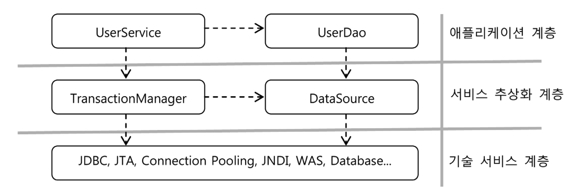

# 목차

 

- [목차](#목차)
- [3 서비스 추상화와 단일 책임 원칙](#3-서비스-추상화와-단일-책임-원칙)
  - [3-1 수직, 수평 계층구조와 의존관계](#3-1-수직-수평-계층구조와-의존관계)
  - [3-2 단일 책임 원칙](#3-2-단일-책임-원칙)
  - [3-3 DI 사랑](#3-3-di-사랑)

 

# 3 서비스 추상화와 단일 책임 원칙

 

## 3-1 수직, 수평 계층구조와 의존관계

 출처: 토비의 스프링 vol.1

* 추상화 기법을 이용하면 특정 기술환경에 종속되지 않는 포터블한 코드를 만들 수 있다.
* 수평적인 분리: `UserService`와 `UserDao`의 관계
* 수직적인 분리: `UserService-TransactionManager`와 `UserDao-DataSource`의 관계

 

## 3-2 단일 책임 원칙
* 단일 책임 원칙이란
  * 하나의 모듈이 바뀌는 이유는 한 가지여야 한다는 의미.
* 기존의 `UserSerive`는 두 가지의 책임을 가지고 있었다. (변경의 이유가 두 가지)
  * 비즈니스 로직(어떻게 사용자 레벨을 관리할 것인가)
  * 트랜잭션 관리
* 이러한 문제를 추상화를 통해 분리시킨 것.

 

## 3-3 DI 사랑
이렇게 추상화하여 기존의 코드를 수정하지 않고 모듈처럼 갈아끼우듯이 사용할 수 있는 이유는 스프링이 DI를 지원해주기 때문이다.

