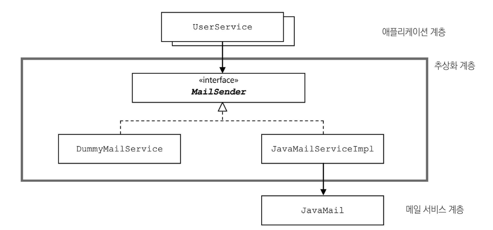
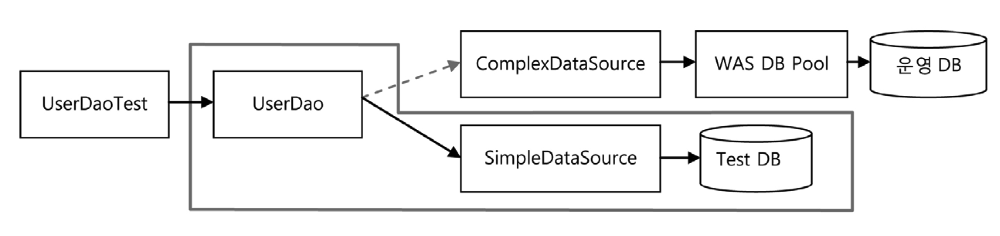
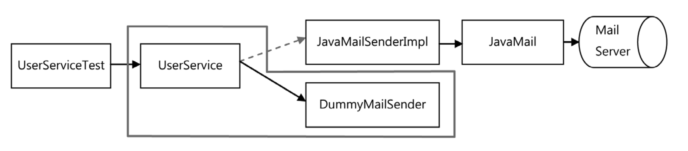
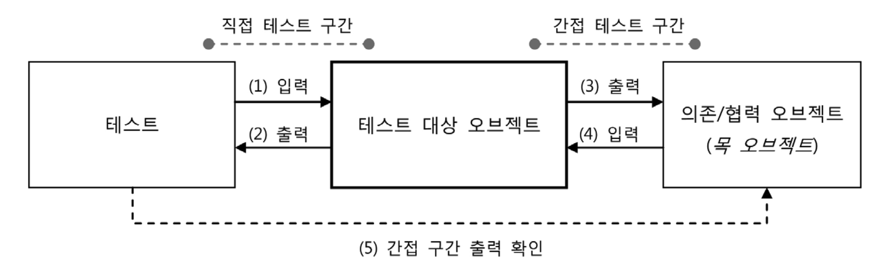

# 목차

<br>

- [목차](#목차)
- [4 메일 서비스 추상화](#4-메일-서비스-추상화)
  - [4-1 JavaMail을 이용한 메일 발송 기능](#4-1-javamail을-이용한-메일-발송-기능)
  - [4-2 JavaMail이 포함된 코드의 테스트](#4-2-javamail이-포함된-코드의-테스트)
  - [4-3 테스트를 위한 서비스 추상화](#4-3-테스트를-위한-서비스-추상화)
  - [4-4 테스트 대역](#4-4-테스트-대역)
- [정리](#정리)

<br>

# 4 메일 서비스 추상화
> 사용자 레벨이 업그레이드될 때 사용자에게 안내 메일을 발송해보자.

<br>

## 4-1 JavaMail을 이용한 메일 발송 기능
**JavaMail**
* 자바에서 메일을 발송할 때 쓰는 표준 기술이다.

```java
private void sendUpgradeEmail(User user) {
        Properties props = new Properties();
        props.put("mail.smtp.host", "mail.ksug.org");
        Session s = Session.getInstance(props, null);

        MimeMessage message = new MimeMessage(s);
        try {
            message.setFrom(new InternetAddress("useradmin@ksug.org"));
            message.addRecipients(RecipientType.TO,
                String.valueOf(new InternetAddress(user.getEmail())));
            message.setSubject("Upgrade 안내");
            message.setText("사용자의 등급이 : " + user.getLevel().name() + "로 업그레이드되었습니다.");

            Transport.send(message);
        } catch (AddressException e) {
            throw new RuntimeException(e);
        } catch (MessagingException e) {
            throw new RuntimeException(e);
        }
    }
```
위 코드는 전형적인 JavaMail을 이용한 메일을 발송하는 코드이다.
* 문제는 DI를 통해서 테스트를 하기 어렵다는 것.

<br>

## 4-2 JavaMail이 포함된 코드의 테스트
😱 위 코드의 문제점

* 매번 메일 서버를 준비해줘야한다.
* 서버가 잘 준비되어 있어도 실제로 매번 메일을 보내므로 테스트하기 까다롭다.
  * 수신한 것을 어떻게 확인할 것인가? 이것도 문제다.

<br>

🤔 그럼 어떻게 하는 것이 좋을까?
* 당연히 프로덕션용과 테스트용으로 분리시키면 된다.
  * 메일 서버를 분리하거나 (메일 서버와 테스트용 메일 서버)
  * JavaMail을 분리하면 된다 (JavaMail과 테스트용 JavaMail)

<br>

## 4-3 테스트를 위한 서비스 추상화
이제 문제와 해결 방법을 알았으니 구현해보자.

실제 메일 전송을 수행하는 JavaMail 대신에 테스트에 사용할, JavaMail과 같은 인터페이스를 갖는 객체를 만들면 된다.

( JDBC에서 `DataSource`로 DB 연결 정보를 분리시키는 것과 같은 개념 )

<br>

😱 **문제는 `DataSource`과 같은 역할을 하는 `Session`이 구체 클래스라는 것.**

* 스프링에선 이 문제를 서비스 추상화로 해결했다.
  * 즉, JavaMail에 대한 추상화 기능을 제공한다.

<p align="center"><br>출처 : 토비의 스프링 vol.1</p>

* 프로덕션에선 `JavaMailServiceImpl`을 사용하고,
* 테스트할 땐 아무 동작도 하지 않는 `DummyMailService`를 이용한다.

```java
// 메일 발송 기능 추상화
public interface MailSender {
    void send(SimpleMailMessage simpleMessage) throws MailException;
    void sned(SimpleMailMessage[] simpleMessage) throws MailException;
}
```
```java
// 스프링의 MailSender과 DI 이용한 메일 발송 메서드
public class UserService {
    ...
    private MailSender mailSender;

    ...

    private void sendUpgradeEmail(User user) {
        SimpleMailMessage mailMessage = new SimpleMailMessage();
        mailMessage.setTo(user.getEmail());
        mailMessage.setFrom("useradmin@ksug.org");
        mailMessage.setSubject("Upgrade 안내");
        mailMessage.setText("사용자님의 등급이 " + user.getLevel().name());

        this.mailSender.send(mailMessage);
    }
}
```
* 위와 같이 DI를 통해 테스트용 더미 MailSender를 넣어주면 테스트가 가능하다.

```java
public class DummyMailSender implements MailSender {

    @Override
    public void send(SimpleMailMessage simpleMessage) throws MailException {
        // ... 아무 일도 하지 않는다. (테스트용이기 때문)
    }

    @Override
    public void send(SimpleMailMessage... simpleMessages) throws MailException {
        // ... 아무 일도 하지 않는다. (테스트용이기 때문)
    }
}
```

<br>

😱 또 하나의 문제는 트랜잭션이다.

레벨 업그레이드 작업 중간에 예외가 발생해서 모두 롤백되었다고 한다면, 메일전송도 모두 롤백되어야한다.

해결 방법으로 2가지가 있다.

1. 매번 메일 발송하지 않고 발송 대상을 별도의 목록에 저장해두고 한 번에 전송.
2. `MailSender`를 확장해서 메일 전송에 트랜잭션 개념을 적용하는 것.

둘 다 각자의 장점이 있으므로, 상황에 맞게 사용하면 된다.

> 이렇게 외부의 리소스와 연동하는 대부분 작업은 추상화의 대상이 될 수 있다.

<br>

## 4-4 테스트 대역

<br>

**1. 테스트 대역**

* 테스트 대역: 의존 객체의 변경을 통한 테스트 방법

<p align="center"><br>UserDao 테스트 대역 구조(DataSource)<br>출처: 토비의 스프링 vol.1</p>

* UserDao의 관심사는 UserDao가 어떻게 동작하는지에 있지, 그 뒤에 DB에 있지 않다.
* 그러므로, 위와 같이 테스트용 객체를 통해 UserDao의 기능을 테스트할 수 있다.

<br>

<p align="center"><br>UserService 메일 전송 테스트 대역 구조(MailSender)<br>출처: 토비의 스프링 vol.1</p>

* UserService의 관심사도 사용자 정보를 가공하는 비즈니스 로직이지, 메일이 어떻게 전송될 것인지가 아니다.

> 위와 같이 테스트 대역을 사용할 때 스프링 DI의 위력이 발휘된다. DI는 유용하다!

<br>

**2. Mock 객체**

<p align="center"><br><br>출처: 토비의 스프링 vol.1</p>

* 목 객체
  * 테스트 대상 객체와 의존 객체 사이에서 일어나는 일을 검증할 수 있도록 가짜 객체를 사용하는 것.
  * 목 객체에게 어떤 메서드 호출 시 특정 값을 리턴하도록 만들어주어야 한다.
* 목 객체의 목적은 행위를 테스트하기 위함이다.

> 목 객체에 대한 자세한 내용은 [여기](https://github.com/binghe819/TIL/blob/master/Test/Mockito/Mockito.md)를 확인하자.

<br>

# 정리
* 비즈니스 로직을 담은 코드는 데이터 액세스 로직을 담은 코드와 깔끔하게 분리되는 것이 바람직하다.
  * 이를 위해서는 DAO의 기술 변화에 서비스 계층의 코드가 영향을 받지 않도록 인터페이스와 DI를 잘 활용해서 결합도를 낮춰줘야 한다.
* DAO를 사용하는 비즈니스 로직에는 단위 작업을 보장해주는 트랜잭션이 필요하다.
  * 트랜잭션의 시작과 종료를 지정하는 일을 트랜잭션 경계설정이라고 한다.
  * 시작된 트랜잭션 정보를 담은 객체를 파라미터로 DAO에 전달하는 방법은 매우 비효율적이다.
  * 대신 스프링이 제공하는 트랜잭션 동기화 기법을 활용하는 것이 편리하다.
* 자바에서 사용되는 트랜잭션 API의 종류와 방법은 다양하며, 환경과 서버에 따라서 트랜잭션 방법이 변경되면 경계설정 코드도 함께 변경돼야 한다.
  * 만약 트랜잭션 방법에 따라 비즈니스 로직을 담은 코드가 함께 변경되면 SRP에 위배되며, DAO가 사용하는 특정 기술에 대해 강한 결합을 만들어낸다.
  * 트랜잭션 경계설정 코드가 비즈니스 로직 코드에 영향을 주지 않게 하려면 스프링이 제공하는 트랜잭션 서비스 추상화를 이용하면 된다.
* 서비스 추상화는 로우레벨의 트랜잭션 기술과 API의 변화에 상관없이 일관된 API를 가진 추상화 계층을 도입한다.
  * 테스트를 편리하게 작성하도록 도와주는 것만으로도 서비스 추상화는 가치가 있다.
* 테스트 대상이 사용하는 객체를 대체할 수 있도록 만든 객체를 테스트 대역이라고 한다.
  * 인터페이스를 하나 두고, 테스트용 구현체를 DI를 통해 주입하면서 테스트하는 방법이 있다.
  * 또 다른 방법은 테스트 대상으로부터 전달받은 정보를 검증할 수 있도록 설계된 목 객체가 있다.
