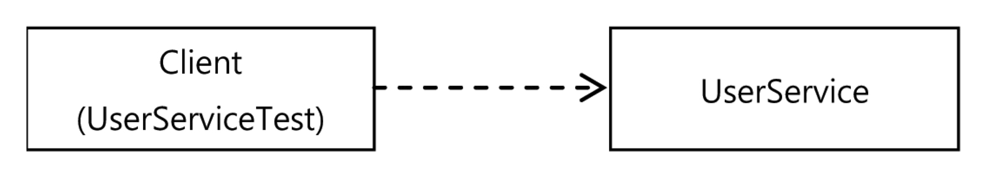
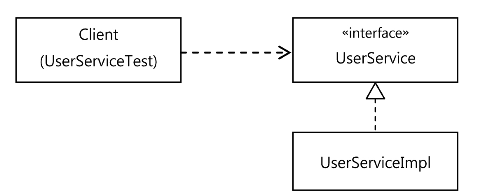
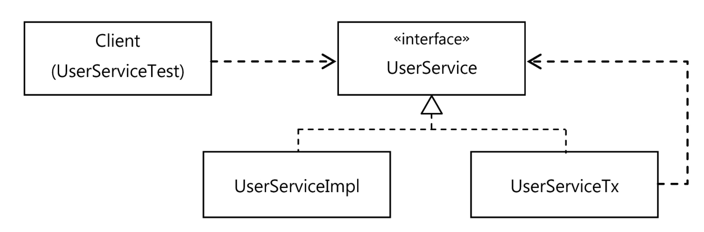
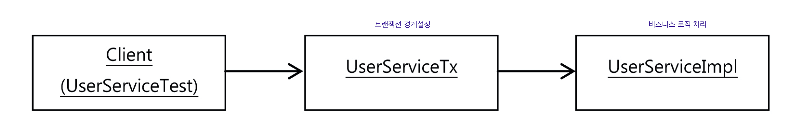

# 목차

<br>

- [목차](#목차)
- [1 트랜잭션 코드의 분리](#1-트랜잭션-코드의-분리)
  - [1-1 메서드 추출](#1-1-메서드-추출)
  - [1-2 DI 적용을 이용한 트랜잭션 분리 (프록시 패턴)](#1-2-di-적용을-이용한-트랜잭션-분리-프록시-패턴)
  - [1-3 트랜잭션과 비즈니스 로직 단위 테스트 - 중요](#1-3-트랜잭션과-비즈니스-로직-단위-테스트---중요)
  - [1-4 트랜잭션 코드 분리의 장점](#1-4-트랜잭션-코드-분리의-장점)

<br>


# 1 트랜잭션 코드의 분리

💁‍♂️ 지금까지 해온 것처럼 트랜잭션 관련된 코드를 분리해보자.

<br>

## 1-1 메서드 추출
> [메서드 추출 코드](https://github.com/binghe819/spring-toby-practice/commit/13a868d174874a7ed75c6714699810bdd8934848)
* 핵심 로직: 비즈니스 로직
* 부가 로직: 트랜잭션 경계 설정

<br>

## 1-2 DI 적용을 이용한 트랜잭션 분리 (프록시 패턴)
> [DI 적용을 이용한 트랜잭션 분리](https://github.com/binghe819/spring-toby-practice/commit/aad29b9939bd3f5c7149af8b66c90e2482b924d4)

**이제 `UserService`에는 순수하게 비즈니스 로직만 존재하고, 트랜잭션 경계 설정 코드는 외부로 빼내보자.**

<br>

:scream: 현재 `UserService` 강한 결합도로 고정되어 있기 때문에, 사이를 비집고 다른 무엇인가를 추가하기 힘들다.

<p align="center"><br>직접 연결을 통한 강한 결합<br> 출처: 토비의 스프링 vol.1</p>

<br>

💁‍♂️ 가장 먼저 시도해볼 리팩토링은 인터페이스를 두고 DI를 적용시키는 것이다.

<p align="center"><br>인터페이스 도입을 통해 약한 결합을 갖는 유연한 구조<br>출처: 토비의 스프링 vol.1</p>

* 보통 **DI를 사용하는 이유**는 다음과 같다.
  * 코드 레벨(컴파일)때 추상적인 것(인터페이스)에 의존하고, 런타임 시에 DI를 통해 구현 클래스를 바꿔가면서 사용하기 위함.
  * 테스트 때는 테스트 구현 클래스를, 정식 운영 중에는 정규 규현 클래스를 DI.
* **하지만 꼭 위와 같이 사용해야한다는 제약은 없다.**
  * **한 번에 두 개의 `UserService` 구현 클래스를 동시에 이용할 수도 있다. -> 프록시**

<br>

💁‍♂️ 프록시 패턴

<p align="center"><br>트랜잭션 경계설정 분리를 위한 UserServiceTx도입 (프록시)<br>출처: 토비의 스프링 vol.1</p>

* `UserServiceImpl` : 비즈니스 로직 역할 담당 (사용자 레벨 관리)
* `UserServiceTx` : 트랜잭션 경계설정 역할 담당
  * **`UserServiceImpl`를 상태로 가지고 있으며, 트랜잭션 경계설정을 하고, 비즈니스 로직 처리를 `UserServiceImpl`에게 위임한다.**

<br>

<p align="center"><br>트랜잭션 기능의 객체가 적용된 의존관계 <br>출처: 토비의 스프링 vol.1</p>

<br>

:point_right: 코드

```java
// UserService 인터페이스
public interface UserService {
    void add(User user);
    void upgradeLevels();
}
```
```java
// 비즈니스 로직을 담당하는 UserServiceImpl
public class UserServiceImpl implements UserService{

    private UserDao userDao;
    private MailSender mailSender;

    public UserServiceImpl(UserDao userDao, MailSender mailSender) {
        this.userDao = userDao;
        this.mailSender = mailSender;
    }

    ...

    public void upgradeLevels() {
        // 비즈니스 로직 (핵심로직)
        List<User> users = userDao.getAll();
        for (User user : users) {
            if (canUpgradeLevel(user)) {
                upgradeLevel(user);
            }
        }
    }

    ...
}
```
```java
// 트랜잭션 경계설정을 담당하는 UserServiceTx
public class UserServiceTx implements UserService {

    // UserService를 구현한 다른 객체를 DI 받는다. (UserServiceImpl)
    private final UserService userService;
    private final PlatformTransactionManager transactionManager;

    public UserServiceTx(UserService userService,
        PlatformTransactionManager transactionManager) {
        this.userService = userService;
        this.transactionManager = transactionManager;
    }

    @Override
    public void add(User user) {
        userService.add(user); // 위임
    }

    @Override
    public void upgradeLevels() {
        // 트랜잭션 경계 설정
        TransactionStatus status = this.transactionManager.getTransaction(new DefaultTransactionDefinition());
        try {
            userService.upgradeLevels(); // 비즈니스 로직 위임
            this.transactionManager.commit(status);
        } catch (RuntimeException e) {
            this.transactionManager.rollback(status);
            throw e;
        }
    }
}
```

## 1-3 트랜잭션과 비즈니스 로직 단위 테스트 - 중요
💁‍♂️  지금까지 프록시를 통해 트랜잭션과 비즈니스 로직을 처리하는 객체를 분리하였다. 이제 테스트 코드도 Mock을 이용해 분리해보자.

<br>

**Mock을 이용한 비즈니스 로직 테스트**

비즈니스 로직을 담당하는 `UserServiceImpl`는 `UserDao`와 `MailSender`에 의존하고 있는 객체이며, 사용자 레벨 관리를 처리한다.

다시 말해, **`MockUserDao`과 `MockMailSender`을 만들어 테스트해야한다. (혹은 Mockito를 사용해도 된다.)**

또한, 중**요한 점은 트랜잭션 경계설정의 책임을 분리하였기 때문에, 트랜잭션 관련 객체(`UserServiceTx`)는 전혀 필요없다.**

* [MockUserDao](https://github.com/binghe819/spring-toby-practice/blob/chapter06/src/test/java/com/binghe/service/MockUserDao.java)
* [MockMailSender](https://github.com/binghe819/spring-toby-practice/blob/chapter06/src/test/java/com/binghe/service/MockMailSender.java)

```java
@DisplayName("Mock을 이용한 단위 테스트 - 트랜잭션 기능을 뺀 비즈니스 로직만을 테스트한다.")
@Test
void upgradeLevels() {
    // 비즈니스 로직만을 처리하는 UserService 구현체
    UserServiceImpl userServiceImpl = new UserServiceImpl(); 
		
    MockUserDao mockUserDao = new MockUserDao(this.users);  
    userServiceImpl.setUserDao(mockUserDao);

    MockMailSender mockMailSender = new MockMailSender();
    userServiceImpl.setMailSender(mockMailSender);
    
    // Mock 객체들을 사용하여 테스트를 진행하게 된다.
    userServiceImpl.upgradeLevels();

    // Mock 객체 안에 상태를 추가하여 유저가 레벨없 되면 남기도록하여 테스트를 진행하였다. (Mock의 장점이기도 하다.)
    List<User> updated = mockUserDao.getUpdated();  
    assertThat(updated.size(), is(2));  
    checkUserAndLevel(updated.get(0), "joytouch", Level.SILVER); 
    checkUserAndLevel(updated.get(1), "madnite1", Level.GOLD);
    
    List<String> request = mockMailSender.getRequests();
    assertThat(request.size(), is(2));
    assertThat(request.get(0), is(users.get(1).getEmail()));
    assertThat(request.get(1), is(users.get(3).getEmail()));
}
```

<br>

<br>

**트랜잭션 테스트**

💁‍♂️  이제 비즈니스 로직은 잘 동작한다는 것을 테스트를 통해 보장했다면, 트랜잭션도 잘 동작하는지 확인해야한다.

```java
@DisplayName("트랜잭션 테스트 - 비즈니스 로직과 트랜잭션 로직 통합 테스트")
@Test
public void upgradeAllOrNothing() {
    // 비즈니스 로직 처리 UserService
    TestUserService testUserService = new TestUserService(users.get(3).getId());
    testUserService.setUserDao(userDao);
    testUserService.setMailSender(mailSender);
    
    // 트랜잭션 경계설정 UserService
    UserServiceTx txUserService = new UserServiceTx();
    txUserService.setTransactionManager(transactionManager);
    txUserService.setUserService(testUserService); // UserServiceImpl를 주입한다. (비즈니스 로직 처리를 위함)
        
    userDao.deleteAll();			  
    for(User user : users) userDao.add(user);
    
    try {
        assertThatThrownBy(() -> userServiceTx.upgradeLevels())
                .isInstanceOf(TestUserServiceException.class);
    }
    catch(TestUserServiceException e) { 
    }
    
    checkLevelUpgraded(users.get(1), false);
}
```
* **내용이 길어보이지만, 사실 비즈니스 로직과 트랜잭션 로직을 분리시키고, 따로 단위 테스트를 진행한 것이다.**

> [전체 코드](https://github.com/binghe819/spring-toby-practice/blob/chapter06/src/test/java/com/binghe/service/UserServiceTest.java)

<br>

## 1-4 트랜잭션 코드 분리의 장점

1. **비즈니스 로직과 트랜잭션 로직의 분리**
   * 비즈니스 로직을 담당하는 `UserServiceImpl` 코드에선 트랜잭션과 같은 기술적인 내용은 전혀 신경쓰지 않아도 된다.
   * **트랜잭션의 적용이 필요한지도 신경쓰지 않아도 된다. 만약 적용시키고 싶다면 `UserServiceTx`와 같이 트랜잭션 기능을 가진 객체가 먼저 실행되도록 만들기만 하면 된다.**
2. 비즈니스 로직에 대한 테스트를 손쉽게 만들어낼 수 있다.
   * 비즈니스 로직과 트랜잭션 로직의 단위 테스트를 따로 할 수 있다.
