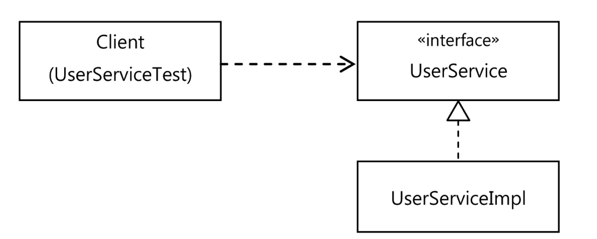

# 목차

<br>

- [목차](#목차)
- [1 트랜잭션 코드의 분리](#1-트랜잭션-코드의-분리)
  - [1-1 메서드 추출](#1-1-메서드-추출)
  - [1-2 DI 적용을 이용한 트랜잭션 분리 (프록시)](#1-2-di-적용을-이용한-트랜잭션-분리-프록시)
  - [1-3 트랜잭션 코드 분리의 장점](#1-3-트랜잭션-코드-분리의-장점)
- [2 고립된 단위 테스트](#2-고립된-단위-테스트)
  - [2-1 복잡한 의존관계 속의 테스트](#2-1-복잡한-의존관계-속의-테스트)
  - [2-2 테스트 대상 객체 고립](#2-2-테스트-대상-객체-고립)
  - [2-3 Mockito를 이용한 리팩토링](#2-3-mockito를-이용한-리팩토링)
  - [2-4 단위 테스트와 통합 테스트](#2-4-단위-테스트와-통합-테스트)

<br>

# 1 트랜잭션 코드의 분리

5장에서 서비스 추상화 기법을 통해 비즈니스 로직(핵심)과 트랜잭션 로직(부가)을 분리할 수 있었다.

하지만 여전히 찜찜한 구석이 존재하는데.. 바로 아래와 같이 트랜잭션 경계설정을 위해 넣은 코드이다.

<p align="center"><br> </p>

<br>

## 1-1 메서드 추출
첫번째로 시도하는 방법은 여전히 메서드 추출기법이다.

<br>

> [메서드 추출 코드](https://github.com/binghe819/spring-toby-practice/commit/13a868d174874a7ed75c6714699810bdd8934848)
* 핵심 로직: 비즈니스 로직
* 부가 로직: 트랜잭션 경계 설정

<br>

## 1-2 DI 적용을 이용한 트랜잭션 분리 (프록시)
두번째로 시도하는 방법은 DI를 활용해서 로직을 분리시킨다.

단순히 로직을 조합을 이용하여 분리시키기보다는 프록시를 활용해서 프록시 객체에 트랜잭션 로직을 담당하게하고, 타겟객체에 비즈니스 로직을 처리하게한다.

<br>

> [DI 적용을 이용한 트랜잭션 분리](https://github.com/binghe819/spring-toby-practice/commit/aad29b9939bd3f5c7149af8b66c90e2482b924d4)

**이제 `UserService`에는 순수하게 비즈니스 로직만 존재하고, 트랜잭션 경계 설정 코드는 외부로 빼내보자.**

<br>

😱 현재 `UserService` 강한 결합도로 고정되어 있기 때문에, 사이를 비집고 다른 무엇인가를 추가하기 힘들다.

<p align="center"><br>직접 연결을 통한 강한 결합<br> 출처: 토비의 스프링 vol.1</p>

<br>

💁‍♂️ 가장 먼저 시도해볼 리팩토링은 인터페이스를 두고 DI를 적용시키는 것이다.

<p align="center"><br>인터페이스 도입을 통해 약한 결합을 갖는 유연한 구조<br>출처: 토비의 스프링 vol.1</p>

* 보통 **DI를 사용하는 이유**는 다음과 같다.
  * 코드 레벨(컴파일)때 추상적인 것(인터페이스)에 의존하고, 런타임 시에 DI를 통해 구현 클래스를 바꿔가면서 사용하기 위함.
  * 테스트 때는 테스트 구현 클래스를, 정식 운영 중에는 정규 구현 클래스를 DI.
* **하지만 꼭 위와 같이 사용해야한다는 제약은 없다.**
  * **한 번에 두 개의 `UserService` 구현 클래스를 동시에 이용할 수도 있다. -> 프록시**

<br>

💁‍♂️ 프록시

<p align="center"><br>트랜잭션 경계설정 분리를 위한 UserServiceTx도입 (프록시)<br>출처: 토비의 스프링 vol.1</p>

* `UserServiceImpl` : 비즈니스 로직 역할 담당 (사용자 레벨 관리)
* `UserServiceTx` : 트랜잭션 경계설정 역할 담당
  * **`UserServiceImpl`를 상태로 가지고 있으며, 트랜잭션 경계설정을 하고, 비즈니스 로직 처리를 `UserServiceImpl`에게 위임한다.**

<br>

<p align="center"><br>트랜잭션 기능의 객체가 적용된 의존관계 <br>출처: 토비의 스프링 vol.1</p>

<br>

:point_right: 코드

```java
// UserService 인터페이스
public interface UserService {
    void add(User user);
    void upgradeLevels();
}
```
```java
// 비즈니스 로직을 담당하는 UserServiceImpl
public class UserServiceImpl implements UserService{

    private UserDao userDao;
    private MailSender mailSender;

    public UserServiceImpl(UserDao userDao, MailSender mailSender) {
        this.userDao = userDao;
        this.mailSender = mailSender;
    }

    ...

    public void upgradeLevels() {
        // 비즈니스 로직 (핵심로직)
        List<User> users = userDao.getAll();
        for (User user : users) {
            if (canUpgradeLevel(user)) {
                upgradeLevel(user);
            }
        }
    }

    ...
}
```
```java
// 트랜잭션 경계설정을 담당하는 UserServiceTx
public class UserServiceTx implements UserService {

    // UserService를 구현한 다른 객체를 DI 받는다. (UserServiceImpl)
    private final UserService userService;
    private final PlatformTransactionManager transactionManager;

    public UserServiceTx(UserService userService,
        PlatformTransactionManager transactionManager) {
        this.userService = userService;
        this.transactionManager = transactionManager;
    }

    @Override
    public void add(User user) {
        userService.add(user); // 위임
    }

    @Override
    public void upgradeLevels() {
        // 트랜잭션 경계 설정
        TransactionStatus status = this.transactionManager.getTransaction(new DefaultTransactionDefinition());
        try {
            userService.upgradeLevels(); // 비즈니스 로직 위임
            this.transactionManager.commit(status);
        } catch (RuntimeException e) {
            this.transactionManager.rollback(status);
            throw e;
        }
    }
}
```

<br>

## 1-3 트랜잭션 코드 분리의 장점

1. **비즈니스 로직과 트랜잭션 로직의 분리**
   * 비즈니스 로직을 담당하는 `UserServiceImpl` 코드에선 트랜잭션과 같은 기술적인 내용은 전혀 신경쓰지 않아도 된다.
   * **트랜잭션의 적용이 필요한지도 신경쓰지 않아도 된다. 만약 적용시키고 싶다면 `UserServiceTx`와 같이 트랜잭션 기능을 가진 객체가 먼저 실행되도록 만들기만 하면 된다.**
2. 비즈니스 로직에 대한 테스트를 손쉽게 만들어낼 수 있다.
   * 비즈니스 로직과 트랜잭션 로직의 단위 테스트를 따로 할 수 있다.

<br>

# 2 고립된 단위 테스트

> 앞 장에선 프록시를 통해 트랜잭션과 비즈니스 로직을 처리하는 객체를 분리하였다. 
> 
> 이번 장에서는 고립된 단위 테스트에 대한 이해와 중요성을 설명하고, 테스트를 직접 작성해본다.

<br>

💁‍♂️ 가장 편하고 좋은 테스트 방법은 가능한 한 작은 단위로 쪼개서 테스트하는 것.

그 이유는 테스트가 실패했을 때 원인을 찾기 쉽고, 빠른 피드백을 받을 수 있기 때문이다.

<br>

## 2-1 복잡한 의존관계 속의 테스트

:scream: 현실에서는 작은 단위로 테스트하기 힘든 경우가 많다. 

`UserService`예시를 통해 왜 힘든지 살펴보자.

<p align="center"><br>UserService를 분리하기 전 테스트 구조<br>출처: 토비의 스프링 vol.1</p>

* 문제점: 테스트가 고립되어 있지 않다.
* `UserService`는 `사용자 정보 관리`하는 비즈니스 로직을 수행한다. 그리고 비즈니스 로직에 대한 성공과 실패에 대해서만 테스트되야한다.
  * 하지만 `UserDao`, `TransactionManager`, `MailSender`에 모두 의존하고 있다.
  * 즉, 의존하고 있는 세 가지 객체가 비즈니스 로직을 수행하는 테스트에서도 같이 수행된다.
* 쉽게 말해, 비즈니스 로직만을 테스트하기 원하지만, 그 뒤의 의존관계까지 모두 테스트 대상이 되버린 것.
  * 비즈니스 로직은 문제 없지만, 그 뒤의 의존관계 객체에서 문제가 생기면 테스트는 실패하게 된다. (통합 테스트가 되버리는 것)

<br>

## 2-2 테스트 대상 객체 고립

💁‍♂️ 여러 의존관계 속의 테스트가 왜 안좋은지 알았다. 이제 테스트를 고립시켜보자.

* 고립시키는 방법은 테스트를 위한 대역을 사용하는 것.
  * OCP + DI 혹은 Mock사용

<br>

책에선 [DI를 통한 프록시패턴](#1-2-di-적용을-이용한-트랜잭션-분리-프록시)을 사용해서 객체를 분리시키고, 테스트도 고립시킨다.

<p align="center"><br>DI와 프록시를 사용한 테스트 고립시킨 구조<br>출처: 토비의 스프링 vol.1</p>

* `MockUserDao`와 `MockMailSender` (테스트 대역)를 만들어 테스트를 고립시킨 것.
  * 비즈니스 로직 테스트
  * 트랜잭션 경계설정 테스트

<br>

<br>

**MockUserDao**
```java
public class MockUserDao implements UserDao {

    // 레벨 업그레이드 후보 User 객체 목록
    private List<User> users;
    // 업그레이드 대상 객체를 저장해둔 목록
    private List<User> updated = new ArrayList();

    public MockUserDao(List<User> users) {
        this.users = users;
    }

    public List<User> getUpdated() {
        return this.updated;
    }

    // 스텁 기능 제공
    public List<User> getAll() {
        return this.users;
    }

    // 목 객체 기능 제공
    public void update(User user) {
        updated.add(user);
    }

    public void add(User user) { throw new UnsupportedOperationException(); }
    public void deleteAll() { throw new UnsupportedOperationException(); }
    public User get(String id) { throw new UnsupportedOperationException(); }
    public int getCount() { throw new UnsupportedOperationException(); }
}
```

* `UserDao`를 스텁이 아닌 목 객체로 따로 만든 이유
  * 부가적인 검증 기능을 수행하기 위함 
  * `upgradeImpl`이 void를 반환하기 때문에 검증하기 힘든 점을 보완하기 위해, DB에 저장되는 객체를 저장하는 목록(List)를 두고 테스트한다.
* 테스트에 사용되지 않는 메서드는 예외를 던져주도록 한다. (혹시 모르기 때문)

<br>

<br>

**MockMailSender**
```java
public class MockMailSender implements MailSender {

    // UserService로부터 전송 요청을 받은 메일 주소 저장.
    private List<String> requests = new ArrayList<String>();

    public List<String> getRequests() {
        return requests;
    }

    public void send(SimpleMailMessage mailMessage) throws MailException {
        requests.add(mailMessage.getTo()[0]);
    }

    public void send(SimpleMailMessage[] mailMessage) throws MailException {
    }
}
```
* 테스트 하기 위해서 `requests` 통해 어떤 메일 전송 요청이 들어왔는지 기록한다.

<br>

<br>

**Mock을 이용한 비즈니스 로직 테스트**

비즈니스 로직을 담당하는 `UserServiceImpl`는 `UserDao`와 `MailSender`에 의존하고 있는 객체이며, 사용자 레벨 관리를 처리한다.

다시 말해, **`MockUserDao`과 `MockMailSender`을 만들어 테스트해야한다. (혹은 Mockito를 사용해도 된다.)**

또한, **중요한 점은 트랜잭션 경계설정의 책임을 분리하였기 때문에, 트랜잭션 관련 객체(`UserServiceTx`)는 전혀 필요없다.**

```java
@DisplayName("Mock을 이용한 단위 테스트 - 트랜잭션 기능을 뺀 비즈니스 로직만을 테스트한다.")
@Test
void upgradeLevels() {
    // 비즈니스 로직만을 처리하는 UserService 구현체
    UserServiceImpl userServiceImpl = new UserServiceImpl(); 
		
    MockUserDao mockUserDao = new MockUserDao(this.users);  
    userServiceImpl.setUserDao(mockUserDao);

    MockMailSender mockMailSender = new MockMailSender();
    userServiceImpl.setMailSender(mockMailSender);
    
    // Mock 객체들을 사용하여 테스트를 진행하게 된다.
    userServiceImpl.upgradeLevels();

    // Mock 객체 안에 상태를 추가하여 유저가 레벨없 되면 남기도록하여 테스트를 진행하였다. (Mock의 장점이기도 하다.)
    List<User> updated = mockUserDao.getUpdated();  
    assertThat(updated.size(), is(2));  
    checkUserAndLevel(updated.get(0), "joytouch", Level.SILVER); 
    checkUserAndLevel(updated.get(1), "madnite1", Level.GOLD);
    
    List<String> request = mockMailSender.getRequests();
    assertThat(request.size(), is(2));
    assertThat(request.get(0), is(users.get(1).getEmail()));
    assertThat(request.get(1), is(users.get(3).getEmail()));
}
```

<br>

<br>

**트랜잭션 테스트**

💁‍♂️  이제 비즈니스 로직은 잘 동작한다는 것을 테스트를 통해 보장했다면, 트랜잭션도 잘 동작하는지 확인해야한다.

```java
@DisplayName("트랜잭션 테스트 - 비즈니스 로직과 트랜잭션 로직 통합 테스트")
@Test
public void upgradeAllOrNothing() {
    // 비즈니스 로직 처리 UserService
    TestUserService testUserService = new TestUserService(users.get(3).getId()); // 3번째에서 예외 발생해서 롤백
    testUserService.setUserDao(userDao);
    testUserService.setMailSender(mailSender);
    
    // 트랜잭션 경계설정 UserService
    UserServiceTx userServiceTx = new UserServiceTx();
    userServiceTx.setTransactionManager(transactionManager);
    userServiceTx.setUserService(testUserService); // UserServiceImpl를 주입한다. (비즈니스 로직 처리를 위함)
        
    userDao.deleteAll();			  
    for(User user : users) userDao.add(user);
    
    try {
        assertThatThrownBy(() -> userServiceTx.upgradeLevels())
                .isInstanceOf(TestUserServiceException.class);
    }
    catch(TestUserServiceException e) { 
    }
    
    checkLevelUpgraded(users.get(1), false);
}
```
* **내용이 길어보이지만, 사실 비즈니스 로직과 트랜잭션 로직을 분리시키고, 따로 단위 테스트를 진행한 것이다.**

> [전체 코드](https://github.com/binghe819/spring-toby-practice/blob/chapter06/src/test/java/com/binghe/service/UserServiceTest.java)


<br>

## 2-3 Mockito를 이용한 리팩토링
💁‍♂️ 단위 테스트를 만들기 위해서는 스텁이나 목 객체의 사용이 필수적이다. 하지만 매번 객체를 따로 만들어주기는 힘들다.

* 이때 사용되는 것이 바로 목 프레임워크다.
* 그리고 가장 대표적인 것이 바로 Mockito이다.

<br>

🤔 Mockito란?
* Mock 객체를 쉽게 만들고 관리하고 검증할 수 있는 방법을 제공하는 프레임워크다.

> 더 자세한 내용은 [여기](https://github.com/binghe819/TIL/blob/master/Test/Mockito/Mockito.md)서 확인가능하다.

<br>

💁‍♂️ Mockito는 다음과 같은 순서로 구현해주면 된다.
1. 인터페이스를 이용해 목 객체를 만든다. (생성)
2. 목 객체가 리턴할 값이 있으면 이를 지정해준다. (예외도 가능)
3. 테스트 대상 객체에 DI해서 목 객체가 테스트 중에 사용되도록 만든다.
4. 테스트 대상 객체를 사용한 후에 목 객체의 특정 메서드가 호출됐는지, 어떤 값을 가지고 몇 번 호출됐는지를 검증한다.

<br>

:point_right: 코드

```java
@DisplayName("Mock을 이용한 단위 테스트 - 트랜잭션 기능을 뺀 비즈니스 로직을 테스트한다.")
@Test
void upgradeLevels() {
    UserServiceImpl userServiceImpl = new UserServiceImpl();

    UserDao mockUserDao = mock(UserDao.class);
    when(mockUserDao.getAll()).thenReturn(this.users);
    userServiceImpl.setUserDao(mockUserDao);

    MailSender mockMailSender = mock(MailSender.class);
    userServiceImpl.setMailSender(mockMailSender);

    userServiceImpl.upgradeLevels();

    // Mockito를 이용해서 어떤 메서드가 몇 번 호출됐는지, 파라미터는 무엇인지 확인할 수 있다.
    verify(mockUserDao, times(2)).update(any(User.class));
    verify(mockUserDao).update(users.get(1));
    assertThat(users.get(1).getLevel()).isEqualTo(Level.SILVER);
    verify(mockUserDao).update(users.get(3));
    assertThat(users.get(3).getLevel()).isEqualTo(Level.GOLD);

    // 파라미터를 정밀하게 검사하기 위해 캡처할 수도 있다.
    ArgumentCaptor<SimpleMailMessage> mailMessageArg = ArgumentCaptor.forClass(SimpleMailMessage.class);
    verify(mockMailSender, times(2)).send(mailMessageArg.capture());
    List<SimpleMailMessage> mailMessages = mailMessageArg.getAllValues();
    assertThat(mailMessages.get(0).getTo()[0]).isEqualTo(users.get(1).getEmail());
    assertThat(mailMessages.get(1).getTo()[0]).isEqualTo(users.get(3).getEmail());
}
```

<br>

## 2-4 단위 테스트와 통합 테스트
🤔 단위? 통합?

* 단위: 단위는 사람마다 정하기 나름이다.
  * 토비님은 Solitary을 단위라고 본다. (Mockist파)
* 통합: 두 개 이상의 단위가 결합해서 동작하면서 테스트가 수행되는 것.
  * 두 개 이상의, 성격이나 계층이 다른 객체가 연동하도록 만들어진 테스트.
  * 외부의 DB나 파일, 서비스등의 리소스가 참여하는 테스트도 통합테스트.

<br>

💁‍♂️ 토비님이 말하시는 단위 테스트와 통합 테스트의 가이드라인

* 항상 단위 테스트를 먼저 고려하라.
* 하나의 클래스나 성격이 같은 긴밀한 클래스 몇 개를 모아서 외부와의 의존관계를 모두 차단하고 필요에 따라 스텁이나 목 객체 등의 테스트 대역을 이용하도록 테스트를 만든다.
* 외부 리소스를 사용해야만 가능한 테스트는 통합 테스트로 만든다.
  * 단위 테스트로 만들기가 어려운 코드도 있다. 대표적으로 DAO.
  * 코드만 보면 하나의 기능 단위를 테스트하는 것이기도하다.
  * DAO 테스트 충분히 검증해두면, DAO를 이용하는 코드는 DAO역할을 스텁이나 목 객체로 대체해서 테스트할 수 있다.
* 여러 개의 단위가 의존관계를 가지고 동작할 때를 위한 통합 테스트는 필요하다. 
  * 다만, 단위 테스트를 충분히 거쳤다면 통합 테스트의 부담은 상대적으로 줄어든다.
* 단위 테스트를 만들기가 너무 복잡하다고 판단되는 코드는 처음부터 통합 테스트를 고려해본다.
  * 이때도 통합 테스트에 참여하는 가능한 한 많은 단위 테스트를 만들어라.
* 스프링 테스트 컨텍스트 프레임워크를 이용하는 테스트는 통합 테스트다.

<br>

> 테스트하기 편하게 만들어진 코드는 깔끔하고 좋은 코드가 될 가능성이 높다!! 테스트하자!!
