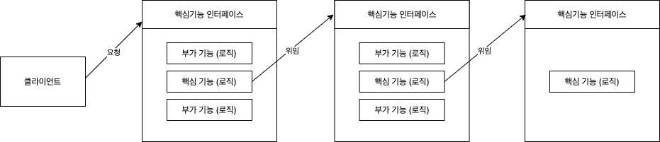

# 목차

<br>

- [목차](#목차)
- [1 프록시, 프록시 패턴, 데코레이터 패턴](#1-프록시-프록시-패턴-데코레이터-패턴)
  - [1-1 프록시](#1-1-프록시)
  - [1-2 데코레이터 패턴](#1-2-데코레이터-패턴)
  - [1-3 프록시 패턴](#1-3-프록시-패턴)
- [2 다이내믹 프록시](#2-다이내믹-프록시)
  - [2-1 프록시의 문제점](#2-1-프록시의-문제점)
  - [2-2 다이내믹 프록시](#2-2-다이내믹-프록시)
  - [2-3 다이내믹 프록시 예시](#2-3-다이내믹-프록시-예시)
    - [대문자 부가기능](#대문자-부가기능)
- [4 다이내믹 프록시를 이용한 트랜잭션 부가기능](#4-다이내믹-프록시를-이용한-트랜잭션-부가기능)
  - [4-1 트랜잭션 InvocationHandler](#4-1-트랜잭션-invocationhandler)
  - [4-2 팩토리 빈](#4-2-팩토리-빈)
    - [다이내믹 프록시 객체는 빈으로 등록할 수 없다](#다이내믹-프록시-객체는-빈으로-등록할-수-없다)
    - [팩토리 빈](#팩토리-빈)
    - [팩토리빈 학습 테스트](#팩토리빈-학습-테스트)
  - [4-3 트랜잭션 프록시 팩토리 빈](#4-3-트랜잭션-프록시-팩토리-빈)
  - [4-4 프록시 팩토리 빈 방식의 장점과 한계](#4-4-프록시-팩토리-빈-방식의-장점과-한계)
    - [장점](#장점)
    - [한계](#한계)

<br>

# 1 프록시, 프록시 패턴, 데코레이터 패턴
> 이번 장에선 앞장에서 구현한 비즈니스 로직과 트랜잭션 로직을 분리하는 구조가 어떤 것인지 **디자인 패턴을 통해 설명**해준다.
> 
> 또한, **프록시/프록시패턴/데코레이터패턴의 차이점에 대해서도 다룬다.**

<br>

## 1-1 프록시

<br>

**전략 패턴의 한계**

<p align="center"><br>전략 패턴을 통한 부가기능 구현의 분리<br>출처: 토비의 스프링 vol.1</p>

* 단순히 확장성을 고려해서 한 가지 기능을 분리한다면 전형적으로 전략 패턴을 생각한다.
  * 하지만, **전략 패턴만으론 기능의 구체적인 구현 내용을 분리만 가능하지, 코드는 그대로 남는다. - 중요**
* **쉽게 말해, 구체적인 구현 코드는 제거했을지라도 위임을 통해 기능을 사용하는 코드는 핵심 코드와 함께 남아있는다.**
  * 즉, 비즈니스 로직과 트랜잭션 로직을 객체로 완전히 분리시킬 수 없다. 그 이유는 전략을 사용하려면 메시지를 호출해줘야하기 때문이다.
* **또한, 핵심 기능과 부가 기능의 순서가 변경되거나, 핵심기능을 사용하지 않는다면, 전략 패턴은 많은 수정이 필요하다.**
  * **다시 말해 객체간의 관계와 순서가 정해져있다.**

> 전략패턴과 프록시의 차이점에 대해서 고민해보면 더 좋을듯하다.

<br>

**🤔 프록시**
> 프록시는 전략 패턴의 한계를 해결해줄 수 있다.

<p align="center"><br>출처: 토비의 스프링 vol.1</p>

* **프록시**
  * 자신이 클라이언트가 사용하려고 하는 실제 대상인 것처럼 위장해서 클라이언트의 요청을 받아주는 것을 의미한다.
  * 대리자, 대리인
* **타깃 (실체)**
  * 프록시를 통해 최종적으로 요청을 위임받아 처리하는 실제 객체를 타깃이라 한다. (핵심 비즈니스)
* **프록시의 기능**
  * 타깃과 같은 메서드를 구현하고 있다가 메서드가 호출되면 타깃 객체로 **위임**한다. **(위임)**
  * 지정된 요청에 대해서는 **부가기능을 수행**한다. **(부가기능 수행)**

<br>

**프록시 특징**
<p align="center"></p>

* **위임**
  * 부가기능 외의 나머지 모든 기능은 원래 핵심기능을 가진 클래스로 위임해줘야 한다. (부가기능에서 핵심로직에게 위임)
* **부가 기능이 핵심 기능을 사용하는 구조**
  * 핵심기능은 부가기능을 구현한 클래스의 존재 자체를 모른다.
  * 따라서 **부가기능이 핵심기능을 사용하는 구조가 된다.**
* **모두 핵심로직(타깃) 인터페이스를 구현해야한다.**
  * 클라이언트 입장에선 인터페이스만 보고 사용하기 때문에 핵심 기능을 가진 객체를 사용할 것이라고 기대한다. 하지만 사실은 부가기능을 통해 핵심기능을 이용하는 것.
  * 그러기위해선 부가로직도 핵심로직 인터페이스를 구현해줘야한다.
  * 이렇게해야 부가기능과 핵심로직의 순서를 자유자재로 변경해줄 수 있다.
* **프록시가 타깃을 제어할 수 있는 위치다.**

<br>

**프록시 사용목적**
* 클라이언트가 타깃에 접근하는 방법을 제어하기 위함 (프록시 패턴)
* 타깃에 부가적인 기능을 부여해주기 위함 (데코레이터 패턴)

<br>

## 1-2 데코레이터 패턴

<br>

🤔 **데코레이터 패턴이란?**
* **타깃에 부가적인 기능을 런타임 시 다이내믹하게 부여해주기 위해 프록시를 사용하는 패턴.**
* **데코레이터의 의미**
  * 마치 제품이나 케익 등을 여러 겹으로 포장하고 그 위에 장식을 붙이는 것처럼 **실제 내용물은 동일하지만 부가적인 효과를 부여해줄 수 있기 때문**이라고 한다.

<br>

🤔 **다이내믹이란?**
* **코드 레벨(컴파일)에서는 어떤 방법과 순서로 프록시와 타깃이 연결되어 사용되는지 정해져 있지 않다는 의미. (동적)**
  * 코드 레벨에선 추상적인 것에 의존하고 있다는 의미. 런타임땐 구체적인 것에 의존.

<br>

:point_right: **예시**
* 소스코드를 출력하는 기능 -> 여러가지 기능을 순서로 조합하여 사용할 수 있다.

<p align="center"><br>출처: 토비의 스프링 vol.1</p>

* 또다른 대표적인 예시로는 자바 IO패키지
  * `InputStream is = new BufferedInputStream(new FileInputStream("a.txt"));`

<br>

**데코레이터 패턴의 특징**

* **자신이 위임하는 다음 대상이 무엇인지 코드레벨에선 모른다.**
  * 모두 타깃 인터페이스로 구현되기 때문에, 자신이 최종 타깃으로 위임하는지, 다음 단계의 프록시로 위임하는지 모른다.
* **순서를 정해줄 수 있다.**
  * 생성자나 setter를 통해 기능별 순서(위임 순서)를 정해줄 수 있다. 
* **구성하기에 따라서 여러 개의 데코레이터를 적용할 수 있다.**
* **타깃의 코드를 손대지 않고, 클라이언트가 호출하는 방법도 변경하지 않은 채로 새로운 기능을 추가할 때 유용하다.**
  * `UserServiceImpl` (비즈니스 로직)에 `UserServiceTx` (트랜잭션 로직)을 추가한 것 처럼!

<br>

**스프링과 데코레이터의 조합**
* **인터페이스를 통한 데코레이터 정의와 런타임 시의 다이내믹한 구성 방법은 스프링의 DI를 이용하면 굉장히 편리한다.**
  * **데코레이터 빈의 상태로 같은 인터페이스를 구현한 다른 데코레이터 또는 타깃 빈을 설정하면 된다.**

<br>

## 1-3 프록시 패턴

<br>

:scream: **프록시 != 프록시 패턴**
* 프록시: 클라이언트와 사용 대상 사이에 대리 역할을 맡은 객체를 두는 방법의 총칭
* 프록시 패턴: 프록시를 사용하는 방법중 **타깃에 대한 접근 방법을 제어하려는 목적**을 가진 패턴.

<br>

🤔 **프록시 패턴이란?**
* 프록시 패턴은 타깃의 기능 자체에는 관여하지 않으면서 접근하는 방법을 제어해주는 프록시를 말한다.
  * 클라이언트가 타깃에 접근하는 방식을 변경해준다.
* 프록시 패턴 vs 데코레이터 패턴
  * **프록시 패턴**: 실제 객체에 대한 **접근을 제어하는데 초점**
  * **데코레이터 패턴**: 기존 객체의 **기능을 확장하는데 초점**

<br>

**프록시 패턴 특징**
* Lazy한 처리가 가능하다.
  * 타깃 객체를 생성하기 복잡하거나 오래 걸린다면, 사용할 때 비로소 프록시 객체에서 타깃 객체를 생성하도록 할 수 있다.
  * 다만, 프록시가 코드에서 타깃을 구체적으로 생성해야한다.
* 아래와 같이 데코레이터와 혼용해서 사용할 수도 있다.

<p align="center"><br>출처: 토비의 스프링 vol.1</p>

<br>

:point_right: **예시**
* 접근 권한
  * `Collection.unmodifiableCollection()`: 컬렉션 접근 권한 제어용 프록시역할
  * 원격 객체에 접근하는 프록시: 다른 서버에 존재하는 객체에 접근해야한다면, 마치 로컬에 있는 것처럼 프록시를 통해 사용할 수 있다.

<br>

# 2 다이내믹 프록시
> 다이내믹 프록시는 무엇이며, 왜 사용하는지, 또한 동작 원리는 무엇인지에 대해서 다룬다.

<br>

## 2-1 프록시의 문제점

:scream: **프록시의 문제점**

프록시는 무조건 좋은 것이란 생각을 하지만 **치명적인 문제점**이 있다.

**바로 매 인터페이스마다 프록시 클래스를 정의해줘야 하는 것이다.**

이로인해 **두 가지의 문제점**을 야기할 수 있다.
1. **부가기능이 필요 없는 메서드도 구현해서 타깃으로 위임하는 코드를 일일이 만들어줘야 한다.**
   * 심지어 타깃 인터페이스의 메서드가 추가되거나 변경될 때마다 함께 수정해줘야 한다.
2. **부가기능 코드가 중복될 가능성이 많다.**
   * 트랜잭션이 필요한 Service마다 프록시(XXXServiceTx)를 만들어줘야하며, 이때 중복된 코드가 발생하게 된다.

<br>

## 2-2 다이내믹 프록시

<br>

🤔 **다이내믹 프록시란?**
* 다이내믹 프록시는 프록시 팩토리에 의해 런타임 시 다이내믹하게 만들어지는 객체를 의미한다.
  * 타깃의 인터페이스와 같은 타입으로 만들어진다.

<br>

🤔 **리플렉션**
* **다이내믹 프록시와 리플렉션**
  * 다이내믹 프록시는 **리플렉션 기능을 이용해서 프록시를 만들어준다.**
  * 다이내믹 프록시를 이해하기 위해서 리플렉션 개념은 꼭 알아야한다.
* **리플렉션이란?**
  * 리플렉션은 자바의 코드 자체를 추상화해서 접근하도록 만든 것.
* **`Class`타입**
  * **자바의 모든 클래스는 그 클래스 자체의 구성정보를 담은 `Class` 타입의 객체를 가지고 있다.**
  * `클래스이름.class`혹은 `getClass()` 메서드를 호출하여 가져올 수 있다.
  * **이를 통해 클래스의 메타 데이터를 가져오거나 객체를 조작할 수 있다.**
    * 클래스 메타 데이터: 이름, 상속 정보, 구현 정보, 필드, 타입, 메서드등등

```java
// 리플렉션 간단한 예시
@Test
void invokeMethod() throws Exception {
    // given
    String name = "binghe";

    // when
    Method lengthMethod = String.class.getMethod("length"); // length
    Method charAtMethod = String.class.getMethod("charAt", int.class); // charAt

    // then
    assertThat(lengthMethod.getName()).isEqualTo("length"); // 메타데이터
    assertThat(charAtMethod.getName()).isEqualTo("charAt"); // 메타데이터
    assertThat(lengthMethod.invoke(name)).isEqualTo(name.length()); // 실행
    assertThat(charAtMethod.invoke(name, 0)).isEqualTo(name.charAt(0)); // 실행
}
```

<br>

🤔 **동작원리**
<p align="center"><br>출처: 토비의 스프링 vol.1</p>

* **프록시 팩토리**
  * 프록시 팩토리에게 인터페이스 정보만 제공해주면 해당 **인터페이스를 구현한 클래스의 객체**를 자동으로 만들어준다.
* `InvocationHandler`
  * **프록시 팩토리가 인터페이스 구현 객체는 만들어주지만, 프록시로서 필요한 부가기능 코드는 직접 작성해야 한다.**
    * 부가기능 코드를 구현하는 것이 바로 `InvocationHandler`의 구현체이다.
  * **다이내믹 프록시 객체가 클라이언트의 모든 요청을 리플렉션 정보로 변환해서 `InvocationHandler` 구현 객체의 `invoke()`메서드로 넘긴다.**
    * `public Object invoke(Object proxy, Method method, Object[] args)`
      * 만들어진 다이내믹 프록시는 메서드 요청을 리플렉션을 이용해 메타 데이터를 뽑아내고,  
      * `Method`와 매개변수와 함께 `InvocationHandler.invoke`에게 메시지 요청한다.

<p align="center"><br>InvocationHandler 처리 구조<br>출처: 토비의 스프링 vol.1</p>

<br>

> 더 자세한 내용은 [여기](https://github.com/binghe819/TIL/blob/master/OOP&%EC%84%A4%EA%B3%84/%EB%94%94%EC%9E%90%EC%9D%B8%ED%8C%A8%ED%84%B4/Dynamic%20Proxy.md#%EB%8F%99%EC%9E%91%EC%9B%90%EB%A6%AC)를 참고.

<br>

## 2-3 다이내믹 프록시 예시

<br>

### 대문자 부가기능
프록시 객체가 입력 값으로 들어온 문자열을 모두 대문자로 변경하는 역할을 담당하는 예시

<br>

**프록시 구현 - 비효율적**
```java
// 타깃 인터페이스
public interface Hello {
    String sayHello(String name);
    String sayHi(String name);
    String sayThankYou(String name);
}
```
```java
// 타깃 클래스
public class HelloTarget implements Hello {

    @Override
    public String sayHello(String name) {
        return "Hello " + name;
    }

    @Override
    public String sayHi(String name) {
        return "Hi " + name;
    }

    @Override
    public String sayThankYou(String name) {
        return "Thank You " + name;
    }
}
```
```java
// 프록시 클래스
public class HelloUppercase implements Hello {
    private final Hello hello;

    public HelloUppercase(Hello hello) {
        this.hello = hello;
    }

    @Override
    public String sayHello(String name) {
        return hello.sayHello(name).toUpperCase();
    }

    @Override
    public String sayHi(String name) {
        return hello.sayHi(name).toUpperCase();
    }

    @Override
    public String sayThankYou(String name) {
        return hello.sayThankYou(name).toUpperCase();
    }
}
```
```java
// 테스트
@Test
void upperProxy() {
    // given
    String name = "binghe";
    Hello hello = new HelloUppercase(new HelloTarget()); // 타깃 객체를 프록시 객체 안으로 주입

    // then
    assertThat(hello.sayHello(name)).isEqualTo("HELLO BINGHE");
    assertThat(hello.sayHi(name)).isEqualTo("HI BINGHE");
    assertThat(hello.sayThankYou(name)).isEqualTo("THANK YOU BINGHE");
}
```
* 문제점
  * 인터페이스의 모든 메서드를 구현해 위임하도록 코드를 만들어야한다.
  * 부가기능인 리턴 값을 대문자로 바꾸는 기능이 모든 메서드에 중복돼서 나타난다.

<br>

**다이내믹 프록시 구현 - 효율적**

```java
// InvocationHandler
public class UppercaseHandler implements InvocationHandler {
    private final Hello target;

    // 다이내믹 프록시로부터 전달받은 요청을 다시 타깃 객체에 위임해야 하기 때문에 타깃 객체를 주입받는다.
    public UppercaseHandler(Hello target) {
        this.target = target;
    }

    @Override
    public Object invoke(Object proxy, Method method, Object[] args) throws Throwable {
        String ret = (String) method.invoke(target, args); // 타깃으로 위임(실행). 인터페이스의 메서드 호출에 모두 적용된다.
        return ret.toUpperCase(); // 부가기능 제공 (리턴값은 클라이언트에게 전해진다.)
    }
}
```
```java
// 테스트
@DisplayName("다이내믹 프록시 테스트 - 동적으로 다이내믹 프록시 객체를 생성한다.")
@Test
void dynamicProxy() {
    // given (다이내믹 프록시 생성)
    Hello dynamicProxy = (Hello) Proxy.newProxyInstance(
        getClass().getClassLoader(), // 클래스 로더
        new Class[] { Hello.class }, // 다이내믹 프록시가 구현해야 할 인터페이스
        new UppercaseHandler(new HelloTarget())); // 부가 기능과 위임 관련 코드를 담고 있는 InvocationHandler

    // then
    assertThat(dynamicProxy.sayHello(name)).isEqualTo("HELLO BINGHE");
    assertThat(dynamicProxy.sayHi(name)).isEqualTo("HI BINGHE");
    assertThat(dynamicProxy.sayThankYou(name)).isEqualTo("THANK YOU BINGHE");
}
```
* **타깃 인터페이스의 모든 메서드 요청이 하나의 메서드(`invoke()`)로 집중되기 때문에 중복되는 기능을 효과적으로 제공할 수 있다.**
  * `sayHello`, `sayHi`, `sayThankYou`등 메서드를 호출하면 리플렉션을 통해 `Method`로 변환되어 `invoke()`에 넘겨진다.
  * 만약 인터페이스의 메서드가 3개가 아닌 30개가 된다면 장점은 더 뚜렷해진다.
* 또한, **타깃의 종류에 상관없이도 적용이 가능하다.**

<br>

조금 더 유연한 프록시를 만들고 싶다면 아래와 같이 리팩토링할 수 있다.

```java
public class UppercaseHandler implements InvocationHandler {
    private final Object target; // String에서 Object로 수정
    
    public UppercaseHandler(Object target) {
        this.target = target;
    }

    @Override
    public Object invoke(Object proxy, Method method, Object[] args) throws Throwable {
        Object ret = method.invoke(target, args); // 타깃으로 위임(실행).
        if (ret instanceof String) { // String인 경우에만 대문자 변경 기능을 적용.
            return ((String) ret).toUpperCase();
        }
        return ret;
    }
}
```

<br>

또한, 만약 `say`가 붙은 메서드에만 프록시를 적용시키고 싶다면 아래와 같이 리팩토링하면 된다.

```java
@Override
public Object invoke(Object proxy, Method method, Object[] args) throws Throwable {
    Object ret = method.invoke(target, args); // 타깃으로 위임(실행).
    if (ret instanceof String && method.getName().startsWith("say")) { // String인 경우에만 대문자 변경 기능을 적용.
        return ((String) ret).toUpperCase();
    }
    return ret;
}
```

<br>

# 4 다이내믹 프록시를 이용한 트랜잭션 부가기능
> 이제 다이내믹 프록시를 알았으니, 프록시로 구현된 `UserService`에 적용시켜보자.

<br>

:scream: **`UserService`는 기존 프록시의 문제점을 그대로 가지고 있다.**

1. 기존의 프록시를 적용한 [UserServiceTx]()는 트랜잭션이 필요한 메서드마다 트랜잭션 처리 코드를 중복해서 사용해줘야한다.
2. 트랜잭션이 필요한 클래스가 증가하면 `UserServiceTx`같은 프록시 클래스를 일일이 만들어줘야 한다.

이제 다이내믹 프록시를 적용시켜 이 문제를 해결해본다.

<br>

## 4-1 트랜잭션 InvocationHandler
```java
public class TransactionHandler implements InvocationHandler {
    private final Object target; // 부가기능을 제공할 타깃 객체 (어떤 타입도 가능하다)
    private final PlatformTransactionManager transactionManager; // 트랜잭션 기능을 제공하는 데 필요한 매니저
    private final String pattern; // 트랜잭션을 적용할 메서드 이름 패턴

    public TransactionHandler(Object target,
        PlatformTransactionManager transactionManager, String pattern) {
        this.target = target;
        this.transactionManager = transactionManager;
        this.pattern = pattern;
    }

    @Override
    public Object invoke(Object proxy, Method method, Object[] args) throws Throwable {
        // 트랜잭션 적용 대상 메서드를 선별해서 트랜잭션 경계설정 기능을 부여해준다.
        if (method.getName().startsWith(pattern)) {
            return invokeInTransaction(method, args);
        }
        return method.invoke(method, args);
    }

    private Object invokeInTransaction(Method method, Object[] args) throws Throwable {
        TransactionStatus status = this.transactionManager.getTransaction(new DefaultTransactionDefinition());
        try {
            // 트랜잭션 시작.
            Object ret = method.invoke(target, args);
            this.transactionManager.commit(status);
            return ret;
        } catch (InvocationTargetException e) {
            // 예외 발생시 롤백
            this.transactionManager.rollback(status);
            throw e.getTargetException();
        }
    }
}
```

* **InvocationHandler에서 모든 메서드를 처리하기 때문에 프록시의 첫번째 문제 해결**
* **타깃을 저장할 변수는 `Object`로 -> 프록시의 두번째 문제 해결**
  * 이제 `UserService`말고도 트랜잭션 적용이 필요한 어떤 타깃 객체도 적용할 수 있다.
* **InvocationHandler에서 처리하는 도중 발생하는 예외는 `RuntimeException`이 아닌 `InvocationTargetException`이다.**
  * 그러므로, 예외를 잡아줄 때 런타임 예외로 잡아주면 안된다.

<br>

클라이언트측(테스트)에선 다음과 같이 생성하여 사용하면 된다.
```java
// 타깃 객체
UserService testUserService = new TestUserService(userDao, mailSender, users.get(3).getId());

// InvocationHandler
TransactionHandler txHandler = new TransactionHandler(testUserService, transactionManager, "upgradeLevels");

// 다이내믹 프록시 생성
UserService userServiceTx = (UserService) Proxy.newProxyInstance(
  getClass().getClassLoader(),
  new Class[] { UserService.class },
  txHandler
);
```

<br>

## 4-2 팩토리 빈
> 이제 다이내믹 프록시를 스프링의 DI에 사용할 수 있도록해보자.
>
> 갑자기 `팩토리 빈?..`라고 생각할 수 있지만, 
> 
> 팩토리 빈은 다이내믹 프록시 객체를 스프링 빈으로 등록하기 위해서 필요한 기술이다.
> 
> 어렵지 않으니 팩토링 빈에 대해서 알아보자.

<br>

### 다이내믹 프록시 객체는 빈으로 등록할 수 없다
다이내믹 프록시에서 스프링 빈을 사용해야 하기 때문에 빈으로 등록해야한다.

<br>

**스프링은 디폴트 생성자를 통해 빈을 생성한다**

하지만 **스프링은 내부적으로 리플렉션 API를 이용해서 빈 정의에 나오는 클래스 이름을 가지고 빈 객체를 생성한다고 한다.**

`Data now = (Data) Class.forName("java.util.data").newInstance();`

<br>

**문제는 다이내믹 프록시는 동적이기 때문에 위와 같이 객체 생성을 하지 않는다.**

즉, **사전에 프록시 객체의 클래스 정보를 미리 알아내서 빈으로 등록할 수 없다.**

> **다이내믹 프록시는 `newProxyInstance()`를 통해서만 생성된다.**

<br>

위와 같은 문제를 해결해주는 방법이 바로 `팩토리 빈`이다.   

<br>

### 팩토리 빈

<br>

🤔 **팩토리 빈이란**
* 스프링은 디폴트 생성자를 통한 객체 생성방법 외에도 팩토리 빈 방법을 제공한다.
* **팩토리 빈이란 스프링을 대신해서 객체의 생성로직을 담당하도록 만들어진 특별한 빈을 말한다.**

<br>

🤔 **팩토리 빈 생성방법**

```java
public interface FactoryBean<T> {
    T getObject() throws Exception; // 빈 객체를 생성해서 돌려준다.
    Class<? extends T> getObjectType(); // 생성되는 객체의 타입을 알려준다.
    boolean isSingleton(); // getObject()가 돌려주는 객체가 싱글톤인지 아닌지.
}
```
*  팩토리 빈을 생성하는 방법은 여러가지 존재하지만, 가장 간단한 방법은 `FactoryBean`을 사용하는 것이다.

<br>

### 팩토리빈 학습 테스트
> 기본 생성자(빈 등록하는 기본 방법)으로 만들지 못하는 도메인을, 
> 
> 팩토리빈으로 등록하는 학습 테스트

```java
// 팩토리 빈 학습용 도메인
public class Message {

    private String text;

    // 기본 생성자를 통해 만들지 못하게 만들었다.
    private Message(String text) {
        this.text = text;
    }

    public static Message newMessage(String text) {
        return new Message(text);
    }

    public String getText() {
        return text;
    }
}
```
```java
// 팩토리 빈 구현
public class MessageFactoryBean implements FactoryBean<Message> {
    private String text;

    // 객체를 생성할 때 필요한 정보를 팩토리 빈의 상태로 설정해서 대신 DI받는다.
    public MessageFactoryBean(String text) {
        this.text = text;
    }

    @Override
    public Message getObject() throws Exception {
        return Message.newMessage(this.text);
    }

    @Override
    public Class<?> getObjectType() {
        return Message.class;
    }

    @Override
    public boolean isSingleton() {
        return false;
    }
}
```
```java
// 빈으로 등록
@Bean
public Message message() throws Exception {
    return new MessageFactoryBean("Factory Bean - binghe").getObject();
}
```
* 중요 포인트는 반환 값이 도메인 타입이라는 것.

<br>

## 4-3 트랜잭션 프록시 팩토리 빈
> 이제 팩토리 빈을 이용해서 트랜잭션 다이내믹 프록시를 적용해보자.

<p align="center"><br>출처: 토비의 스프링 vol.1</p>

* 스프링 빈에는 다이내믹 프록시 객체에서 사용할 타깃 객체와 팩토리 빈만 등록하면 된다.

```java
// FactoryBean 구현체
public class TxProxyFactoryBean implements FactoryBean<Object> {
    // TransactionHandler를 사용할 때 필요한 의존성
    private Object target;
    private PlatformTransactionManager transactionManager;
    private String pattern;
    // 다이내믹 프록시를 생성할 때 필요한 의존성 (UserService외 인터페이스에도 적용이 가능하다.)
    private Class<?> serviceInterface;

    // ... 생성자, setter

    @Override
    public Object getObject() throws Exception {
        TransactionHandler txHandler = new TransactionHandler(target, transactionManager, pattern);
        return Proxy.newProxyInstance(
            getClass().getClassLoader(),
            new Class[] { serviceInterface },
            txHandler
        );
    }

    @Override
    public Class<?> getObjectType() {
        return serviceInterface;
    }

    @Override
    public boolean isSingleton() {
        return false; // 싱글톤이 아니라는 의미.
    }
}
```
```java
// 빈 설정
@Bean
public TxProxyFactoryBean txProxyFactoryBean() {
    return new TxProxyFactoryBean(
        userServiceImpl(),
        platformTransactionManager(),
        "upgradeLevels",
        UserService.class);
}
```
```java
// 사용시 아래와 같이 setter를 통해 타깃을 테스트용으로 변경해 테스트할 수 있다.
TestUserService testUserService = new TestUserService(userDao, mailSender, users.get(3).getId());

txProxyFactoryBean.setTarget(testUserService);
UserService userServiceTx = (UserService) txProxyFactoryBean.getObject();

...
```

<br>

## 4-4 프록시 팩토리 빈 방식의 장점과 한계

<br>

### 장점

**프록시 팩토리 빈을 재사용할 수 있다**

<p align="center"><br>출처: 토비의 스프링 vol.1</p>

* 만약 트랜잭션이 필요한 `CoreService`가 생겼다고 가정해보면, 기존에 만들었던 `TxProxyFactoryBean`을 이용해서 트랜잭션 기능을 추가해줄 수 있다.

<br>

**다이내믹 프록시를 스프링 DI에서 사용할 수 있다**

<br>

### 한계

<br>

**설정파일에서의 중복**
* 코드에선 중복이 일어나지 않지만, 설정파일(configuration)에서 중복이 발생한다. (XML 혹은 자바 설정파일)

<br>

**새로운 부가기능을 추가하면 설정파일이 복잡해진다**
* 하나의 타깃에 여러 개의 부가기능을 적용시키려면, 설정 파일이 굉장히 길어지고 복잡해진다.

<br>

**TransactionHandler를 중복해서 생성해야한다.**
* 프록시 객체마다 타깃 객체가 다르기 때문에, 타깃마다 새로운 `TransactionHandler`를 만들어줘야한다.

