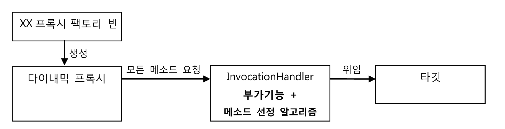
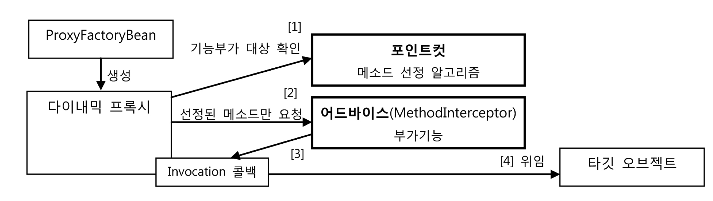

# 목차

<br>

- [목차](#목차)
- [1 ProxyFactoryBean](#1-proxyfactorybean)
  - [1-1 ProxyFactoryBean이란](#1-1-proxyfactorybean이란)
  - [1-2 MethodInterceptor](#1-2-methodinterceptor)
  - [1-3 ProxyFactoryBean 학습 테스트](#1-3-proxyfactorybean-학습-테스트)
  - [1-4 Advice: 타깃이 필요 없는 순수한 부가기능](#1-4-advice-타깃이-필요-없는-순수한-부가기능)
  - [1-5 PointCut: 부가기능 적용 대상 메서드 선정 방법](#1-5-pointcut-부가기능-적용-대상-메서드-선정-방법)
- [2 다이내믹 프록시와 스프링 프록시 팩토리 빈](#2-다이내믹-프록시와-스프링-프록시-팩토리-빈)
  - [2-1 다이내믹 프록시의 한계](#2-1-다이내믹-프록시의-한계)
  - [2-2 스프링 프록시 팩토리 빈](#2-2-스프링-프록시-팩토리-빈)
- [2 ProxyFactoryBean 적용](#2-proxyfactorybean-적용)

<br>

# 1 ProxyFactoryBean
> 지금까지 프록시 -> 다이내믹 프록시 -> 팩토리 빈 -> 스프링 DI순으로 트랜잭션 기능을 분리시켜보았다.
> 
> 하지만, 프록시 팩토리 빈도 한계가 있다. 이제 그 문제를 해결한 스프링 기술에 대해서 알아보자.

<br>

## 1-1 ProxyFactoryBean이란
* 스프링은 팩토리 빈의 한계를 극복한 기술을 추상화하여 제공해준다.
  * 즉, ProxyFactoryBean은 추상화된 팩토리 빈이다.
* **ProxyFactoryBean은 프록시를 생성해서 빈 객체로 등록하게 해주는 팩토리 빈이다.**
  * **`ProxyFactoryBean`은 순수하게 프록시를 생성하는 작업만을 담당하고 프록시를 통해 제공해줄 부가기능은 별도의 빈에 둘 수 있다.**
  * 기존의 팩토리 빈은 프록시마다 의존하는 타깃이 다르기 때문에, 부가기능을 담당하는 객체(`InvocationHandler`)를 별도의 빈으로 등록할 수 없었다.

<br>

## 1-2 MethodInterceptor
```java
// 대문자로 전환하는 부가기능 예시
public class UppercaseAdvice implements MethodInterceptor {

    @Override
    public Object invoke(MethodInvocation invocation) throws Throwable {
        // InvocationHandler의 리플렉션 Method와 달리 메서드 실행 시 타깃 객체를 전달할 필요가 없다.
        // MethodInvocation은 메서드 정보와 함께 타깃 객체를 알고 있기 때문.
        String ret = (String) invocation.proceed();
        return ret.toUpperCase();
    }
}
```

* **`MethodInterceptor`란**
  * ProxyFactoryBean은 부가 기능 구현하는 인터페이스로 `InvocationHandler`대신 `MethodInterceptor`를 사용한다.
* **`InvocationHandler`와의 한 가지 차이점**
  * `InvocationHandler`의 `invoke()` 메서드는 타깃 객체에 대한 정보를 제공하지 않는다.
    * 따라서 타깃은 `InvocationHandler`를 구현한 클래스가 직접 알고 있어야 한다. (멤버 변수로)
  * **`MethodInterceptor`의 `invoke()` 메서드는 ProxyFactoryBean로부터 타깃 객체에 대한 정보까지도 함께 제공받는다.**
    * **이 차이 덕분에 `MethodInterceptor`는 타깃 객체에 상관없이 독립적으로 만들어질 수 있다.**
    * **따라서, 타깃이 다른 여러 프록시에 함께 사용이되며, 싱글톤 빈으로 등록 가능하다.**

<br>

## 1-3 ProxyFactoryBean 학습 테스트
```java
// 기존의 다이내믹 프록시 (JDK 다이내믹 프록시)
@Test
public void simpleDynamicProxy() {
    Hello proxiedHello = (Hell) Proxy.newProxyInstance(
        getClass().getClassLoader(),
        new Class[] { Hello.class },
        new UpperCaseHandler(new HelloTarget())
    );
}
```
```java
// 어드바이스(추가기능) 정의
public class UppercaseAdvice implements MethodInterceptor {

    @Override
    public Object invoke(MethodInvocation invocation) throws Throwable {
        // InvocationHandler의 리플렉션 Method와 달리 메서드 실행 시 타깃 객체를 전달할 필요가 없다.
        // MethodInvocation은 메서드 정보와 함께 타깃 객체를 알고 있기 때문.
        String ret = (String) invocation.proceed();
        return ret.toUpperCase();
    }
}

// 프록시 팩토리 빈 (스프링 프록시 팩토리 빈)
@Test public
public void proxyFactoryBean() {
    ProxyFactoryBean pfBean = new ProxyFactoryBean();
    pfBean.setTarget(new HelloTarget()); // 타깃 설정
    pfBean.addAdvice(new UppercaseAdvice()); // 부가 기능 어드바이스 추가

    // 프록시 객체 가져오기
    Hello proxiedHello = (Hello) pfBean.getObject();

    // 프록시 객체 사용 ...
}
```

* 차이점
  * **`MethodInterceptor` 구현체에는 타깃 객체가 등장하지 않는다.**
    * 이유는 `MethodInvocation` 객체 안에 타깃 객체가 담겨있기 때문.
    * `MethodInvocation`이 타깃 객체를 실행할 기능이 있기 때문에, `MethodInterceptor`는 부가기능에만 집중할 수 있다.
  * 프록시 팩토리 빈은 타깃 객체의 인터페이스를 넘겨주지 않아도 된다.
    * 자체적인 인터페이스 자동검출 기능을 사용해서 인터페이스 정보를 얻는다고 한다.
* `MethodInvocation`
  * **`MethodInvocation`은 일종의 콜백 객체로, `proceed()`메서드를 실행하면 타깃 객체의 메서드를 내부적으로 실행해준다.**
  * 즉, **`MethodInvocation` 구현 클래스는 일종의 공유 가능한 템플릿처럼 동작한다. (템플릿/콜백 구조를 응용함)**
  * 마치 SQL에 종속되지 않아서 수많은 DAO메서드와 공유할 수 있는 JdbcTemplate과 유사하다.

## 1-4 Advice: 타깃이 필요 없는 순수한 부가기능
```java
ProxyFactoryBean pfBean = new ProxyFactoryBean();
pfBean.setTarget(new HelloTarget()); // 타깃 설정
pfBean.addAdvice(new UppercaseAdvice()); // 부가 기능 어드바이스 추가
```
* Advice의 의미
  * **타깃 객체에 적용하는 부가기능을 담은 객체를 어드바이스라고 부른다.**
  * 쉽게 말해, **어드바이스는 타깃 객체에 종속되지 않는 순수한 부가기능을 담는 객체다.**
  * `MethodInterceptor`는 `Advice`인터페이스를 상속하고 있다.
* **프록시 팩토리 빈에는 여러 개의 어드바이스를 추가할 수 있다.**
  * 어드바이스는 `MethodInterceptor`의 구현체이다.
  * 여러 개의 어드바이스를 추가할 수 있다는 의미는 새로운 부가기능이 추가될 때마다 프록시와 프록시 팩토리 빈도 추가해줘야 한다는 문제를 해결했다는 의미.
* 스프링 DI에 빈으로 등록되어, 싱글톤으로 재활용될 수 있다.

<br>

## 1-5 PointCut: 부가기능 적용 대상 메서드 선정 방법
* PointCut의 의미
  * 메서드 선정 알고리즘
  * ex. 메서드명이 `add`로 시작하는 메서드에만 부가기능 적용
* 프록시 팩토리 빈에서는 메서드 선정 알고리즘을 부가기능을 실행하는 객체(어드바이스)가 아닌 다이내믹 프록시로 옮겼다.
  * 이와 관련해서는 아래 []()에서 확인하자.

<br>

# 2 다이내믹 프록시와 스프링 프록시 팩토리 빈
> 이제 스프링 프록시 팩토리 빈이 어떤 것인지는 알았다..
> 
> 하지만, 아직 다이내믹 프록시와의 차이점이 와닿지 않는다.
> 
> 둘의 차이점을 알아보자.

<br>

## 2-1 다이내믹 프록시의 한계
<p align="center"><br>출처: 토비의 스프링 vol.1</p>

* 부가기능을 가진 `InvocationHandler`가 타깃과 메서드 선정 알고리즘 코드에 의존하고 있다.
  * 만약 타깃이 다르고 메서드 선정 방식이 다르다면 `InvocationHandler`객체를 여러 프록시가 공유할 수 없다.
* 부가기능(`InvocationHandler`)를 빈으로 등록할 수도 없다.
  * 한번 빈으로 구성되면, 객체 차원에서 특정 타깃을 위한 프록시에 제한되어버린다.
  * 그래서 빈으로 등록하지 않고, 팩토리 빈에서 매번 생성하도록 만들어줘야한다. (싱글톤으로 사용 불가)
* 부가기능과 메서드 선정 알고리즘을 완벽히 분리시키지 못하므로, 결합도가 높다.

<br>

## 2-2 스프링 프록시 팩토리 빈

<p align="center"><br>출처: 토비의 스프링 vol.1</p>

* 

<br>

# 2 ProxyFactoryBean 적용


