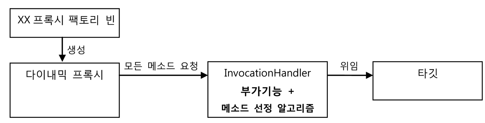
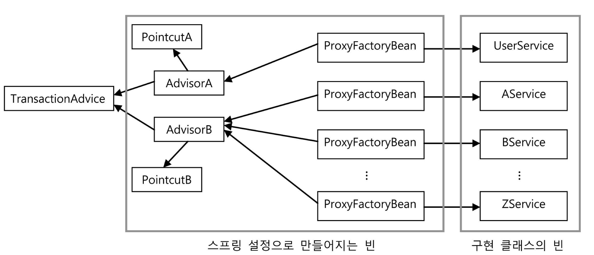

# 목차

<br>

- [목차](#목차)
- [1 ProxyFactoryBean](#1-proxyfactorybean)
  - [1-1 ProxyFactoryBean이란](#1-1-proxyfactorybean이란)
  - [1-2 MethodInterceptor](#1-2-methodinterceptor)
  - [1-3 ProxyFactoryBean 학습 테스트](#1-3-proxyfactorybean-학습-테스트)
  - [1-4 Advice: 타깃이 필요 없는 순수한 부가기능](#1-4-advice-타깃이-필요-없는-순수한-부가기능)
  - [1-5 PointCut: 부가기능 적용 대상 메서드 선정 방법](#1-5-pointcut-부가기능-적용-대상-메서드-선정-방법)
  - [1-6 Advice와 PointCut 학습 테스트](#1-6-advice와-pointcut-학습-테스트)
  - [1-7 어드바이저 = 포인트컷(메서드 선정 알고리즘) + 어드바이스(부가기능)](#1-7-어드바이저--포인트컷메서드-선정-알고리즘--어드바이스부가기능)
- [2 ProxyFactoryBean 적용](#2-proxyfactorybean-적용)
  - [2-1 트랜잭션 적용 예시](#2-1-트랜잭션-적용-예시)
  - [2-2 어드바이스와 포인트컷의 재사용](#2-2-어드바이스와-포인트컷의-재사용)
  - [2-3 여전히 문제가 있다 - 매번 설정을 해줘야한다는 것](#2-3-여전히-문제가-있다---매번-설정을-해줘야한다는-것)

<br>

# 1 ProxyFactoryBean
지금까지 프록시 -> 다이내믹 프록시 -> 팩토리 빈 순으로 트랜잭션 기능을 분리시켜보았다.

하지만, **팩토리 빈도 [한계](./6장-2%20다이내믹%20프록시와%20팩토리%20빈.md#한계)가 있다.**

**바로 부가 기능을 담당하는 `InvocationHandler`가 타깃 객체를 알고있어야한다는 것이다.**

**이로 인해 새로운 타깃 객체 (ex. `xxxService`)가 나올 때마다 새롭게 설정을 해줘야한다.**

이제 그 문제를 해결한 스프링 기술인 `ProxyFactoryBean`에 대해서 알아본다.

<br>

## 1-1 ProxyFactoryBean이란
* 스프링은 팩토리 빈의 한계를 극복한 기술을 추상화하여 제공해준다.
  * 즉, **ProxyFactoryBean은 추상화된 팩토리 빈이다.**
* **ProxyFactoryBean은 프록시를 생성해서 빈 객체로 등록하게 해주는 팩토리 빈이다.**
  * **`ProxyFactoryBean`은 순수하게 프록시를 생성하는 작업만을 담당하고 프록시를 통해 제공해줄 부가기능은 별도의 빈에 둘 수 있다.**
  * 기존의 팩토리 빈은 프록시마다 의존하는 타깃이 다르기 때문에, 부가기능을 담당하는 객체(`InvocationHandler`)를 별도의 빈으로 등록할 수 없었다.
* 기존의 FactoryBean와 ProxyFactoryBean의 차이점
  * 기존의 FactoryBean은 프록시를 생성하고 타깃을 설정하는 역할을 한다. 반면에 ProxyFactoryBean은 프록시를 생성하는 역할만 해주면된다.
    * FactoryBean: 프록시 생성 + 타깃 설정
    * ProxyFactoryBean: 프록시 생성
  * 이게 가능한 이유는 `MethodInterceptor`를 사용하기 때문이다.

<br>

## 1-2 MethodInterceptor
```java
// 대문자로 전환하는 부가기능 예시
public class UppercaseAdvice implements MethodInterceptor {

    @Override
    public Object invoke(MethodInvocation invocation) throws Throwable {
        // InvocationHandler의 리플렉션 Method와 달리 메서드 실행 시 타깃 객체를 전달할 필요가 없다.
        // MethodInvocation은 메서드 정보와 함께 타깃 객체를 알고 있기 때문.
        String ret = (String) invocation.proceed();
        return ret.toUpperCase();
    }
}
```

* **`MethodInterceptor`란**
  * ProxyFactoryBean은 부가 기능 구현하는 인터페이스로 `InvocationHandler`대신 `MethodInterceptor`를 사용한다.
  * 둘은 비슷하지만 한 가지 차이점이 존재한다.
* **`InvocationHandler`와의 한 가지 차이점**
  * **`InvocationHandler`의 `invoke()` 메서드는 타깃 객체에 대한 정보를 제공하지 않는다.**
    * 따라서 `InvocationHandler`마다 타깃을 따로 설정해주어야하며, 멤버 변수로 직접 가지고있어야한다.
  * **`MethodInterceptor`의 `invoke()` 메서드는 ProxyFactoryBean로부터 타깃 객체에 대한 정보까지도 함께 제공받는다.**
    * **이 차이 덕분에 `MethodInterceptor`는 타깃 객체에 상관없이 독립적으로 만들어질 수 있다. - 중요**
    * **따라서, 타깃이 다른 여러 프록시에 함께 사용이되며, 싱글톤 빈으로 등록 가능하다. - 중요**

> * **`InvocationHandler` -> `InvocationHandler 1 : 1 타깃` -> 타깃에 상관없이 재활용 불가**
>   * 타깃을 알고있어야하기에, 새로운 타깃이 생긴다면 기존의 `InvocationHandler`를 재활용하지 못한다.
>   * 이로인해 새로운 타깃이 생긴다면 매번 팩토리 빈을 생성해줘야한다.
> * **`MethodInterceptor` -> `MethodInterceptor 1 : N 타깃` -> 타깃에 상관없이 재활용 가능**
>   * MethodInterceptor로 들어오는 메서드 호출엔 타깃도 포함되어있기에 타깃이 어떤 것이든 프록시 로직을 그대로 재활용할 수 있다.

<br>

## 1-3 ProxyFactoryBean 학습 테스트
```java
// 기존의 다이내믹 프록시 (JDK 다이내믹 프록시)
@Test
public void simpleDynamicProxy() {
    Hello proxiedHello = (Hell) Proxy.newProxyInstance(
        getClass().getClassLoader(),
        new Class[] { Hello.class },
        new UpperCaseHandler(new HelloTarget())
    );
}
```
```java
// 어드바이스(추가기능) 정의
public class UppercaseAdvice implements MethodInterceptor {

    @Override
    public Object invoke(MethodInvocation invocation) throws Throwable {
        // InvocationHandler의 리플렉션 Method와 달리 메서드 실행 시 타깃 객체를 전달할 필요가 없다.
        // MethodInvocation은 메서드 정보와 함께 타깃 객체를 알고 있기 때문.
        String ret = (String) invocation.proceed();
        return ret.toUpperCase();
    }
}

// 사용 및 테스트
@Test public
public void proxyFactoryBean() {
    ProxyFactoryBean pfBean = new ProxyFactoryBean();
    pfBean.setTarget(new HelloTarget()); // 타깃 설정
    pfBean.addAdvice(new UppercaseAdvice()); // 부가 기능 어드바이스 추가

    // 프록시 객체 가져오기
    Hello proxiedHello = (Hello) pfBean.getObject();

    // 프록시 객체 사용 ...
}
```

* 예시 코드로 보는 차이점
  * **`MethodInterceptor` 구현체에는 타깃 객체가 등장하지 않는다.**
    * 이유는 `MethodInvocation` 객체 안에 타깃 객체가 담겨있기 때문.
    * **`MethodInvocation`이 타깃 객체를 실행할 기능이 있기 때문에, `MethodInterceptor`는 부가기능에만 집중할 수 있다.**
* **`MethodInvocation` -> JDK의 다이내믹 프록시와 스프링의 ProxyFactoryBean의 가장 큰 차이점이기도 하다.**
  * **`MethodInvocation`은 일종의 콜백 객체로, `proceed()`메서드를 실행하면 타깃 객체의 메서드를 내부적으로 실행해준다.**
  * 즉, **`MethodInvocation` 구현 클래스는 일종의 공유 가능한 템플릿처럼 동작한다. (템플릿/콜백 구조를 응용함)**
    * 마치 SQL에 종속되지 않아서 수많은 DAO메서드와 공유할 수 있는 JdbcTemplate과 유사하다.

<br>

## 1-4 Advice: 타깃이 필요 없는 순수한 부가기능
```java
ProxyFactoryBean pfBean = new ProxyFactoryBean();
pfBean.setTarget(new HelloTarget()); // 타깃 설정
pfBean.addAdvice(new UppercaseAdvice()); // 부가 기능 어드바이스 추가
```
* Advice의 의미
  * **타깃 객체에 적용하는 부가기능을 담은 객체를 어드바이스라고 부른다.**
  * 쉽게 말해, **어드바이스는 타깃 객체에 종속되지 않는 순수한 부가기능을 담는 객체다. - 가장 중요 -> 이로인해 재활용 가능한 것.**
  * `MethodInterceptor`는 `Advice`인터페이스를 상속하고 있다.
* **프록시 팩토리 빈에는 여러 개의 어드바이스를 추가할 수 있다.**
  * 어드바이스는 `MethodInterceptor`의 구현체이다.
  * **여러 개의 어드바이스를 추가할 수 있다는 의미는 새로운 부가기능이 추가될 때마다 프록시와 프록시 팩토리 빈도 추가해줘야 한다는 문제를 해결했다는 의미.**
* 프록시 팩토리 빈은 타깃 객체의 인터페이스를 넘겨주지 않아도 된다.
  * **자체적인 인터페이스 자동검출 기능을 사용해서 인터페이스 정보를 얻는다고 한다.**
  * 물론 따로 인터페이스 타입을 설정해줄 수도 있긴하다. 하지만 이렇게되면 재활용(범용성)면에서 좋지않다.
* 스프링 DI에 빈으로 등록되어, 싱글톤으로 재활용될 수 있다. 

> ProxyFactorBean은 기본적으로 JDK의 다이내믹 프록시를 사용한다. 경우에 따라서 CGLIB로 사용할 수도 있다.
> 
> 참고: [ProxyFactoryBean - spring docs](https://docs.spring.io/spring-framework/docs/current/reference/html/core.html#aop-understanding-aop-proxies)

<br>

## 1-5 PointCut: 부가기능 적용 대상 메서드 선정 방법

<br>

🤔 **PointCut의 의미**

* 메서드 선정 알고리즘
  * ex. 메서드명이 `add`로 시작하는 메서드에만 부가기능 적용, 특정 애노테이션 붙은 메서드에만 부가기능 적용.
* **프록시 팩토리 빈에서는 메서드 선정 알고리즘을 부가기능을 실행하는 객체(어드바이스)가 아닌 다이내믹 프록시로 옮겼다.**
  * 그 이유는 `MethodInterceptor`는 여러 프록시가 공유해서 사용하기에, **특정 타깃 객체에 종속된 로직을 넣으면 문제가 된다.**

<br>

🤔 **ProxyFactoryBean에서는 PointCut을 부가기능을 실행하는 객체(어드바이스)가 아닌 다이내믹 프록시로 옮겼다. 그 이유는?**

<p align="center"><br>기존의 JDK 다이내믹 프록시 이용한 방식<br>출처: 토비의 스프링 vol.1</p>

* 위와 같이 기존의 JDK 다이내믹 프록시처럼 어드바이스에 PointCut을 넣으면 아래와 같은 문제가 있다.
  * **`InvocationHandler`가 타깃과 메서드 알고리즘 코드에 의존한다.**
  * 이는 **`InvocationHandler`가 여러 타깃에 재활용할 수 없다는 것을 의미한다.**

<br>

<p align="center"><br>스프링 ProxyFactoryBean을 이용한 방식<br>출처: 토비의 스프링 vol.1</p>

* 위와 같이 스프링 ProxyFactoryBean은 위와 같이 두 가지 역할을 분리하였다.
  1. 부가기능 (어드바이스)
  2. 메서드 선정 알고리즘 (포인트컷)
* 위 그림을 보면 전형적인 템플릿/콜백 구조인 것을 알 수 있다.
  * 어드바이스: 템플릿
    * 템플릿도 한 번 만들어 재활용하듯이, 어드바이스도 한번 만들어 재활용할 수 있다.
  * 타깃을 호출하는 기능을 갖고있는 MethodInvocation가 콜백

> **어드바이스와 포인트컷은 모두 프록시에 DI로 주입돼서 사용된다. 이로 인해, 두 객체 모두 스프링의 싱글톤 빈으로 등록할 수 있다. - 중요**
> * 어드바이스는 보통 `MethodInterceptor`를 구현해서 생성한다.
> * 포인트컷은 보통 `Pointcut`를 구현해서 생성한다.

<br>

## 1-6 Advice와 PointCut 학습 테스트
이제 간단히 두 개념에 대한 학습 테스트를 진행해본다.

```java
@DisplayName("프록시 팩토리 빈 테스트 - Advice + PointCut 테스트")
@Test
void proxyFactoryBean_Advice_PointCut() {
    // given
    String name = "binghe";
    ProxyFactoryBean pfBean = new ProxyFactoryBean();
    pfBean.setTarget(new HelloTarget());

    // Advice, PointCut 설정
    NameMatchMethodPointcut pointcut = new NameMatchMethodPointcut(); 
    pointcut.setMappedName("sayH*");
    pfBean.addAdvisor(new DefaultPointcutAdvisor(pointcut, new UppercaseAdvice()));

    // when
    Hello proxiedHello = (Hello) pfBean.getObject();

    // then
    assertThat(proxiedHello.sayHi(name)).isEqualTo("HI " + name.toUpperCase());
    assertThat(proxiedHello.sayHello(name)).isEqualTo("HELLO " + name.toUpperCase());
    assertThat(proxiedHello.sayThankYou(name)).isEqualTo("Thank You " + name);
}
```
* **`Advice`와 `PointCut`을 같이 설정해줘야하는이유**
  * ProxyFactoryBean은 여러 개의 어드바이스와 포인트 컷을 추가할 수 있다.
  * **특정 어드바이스에 특정 포인트 컷을 적용하기위해 둘을 같이 설정해주는 것. -> 다양한 조합이 가능**

<br>

## 1-7 어드바이저 = 포인트컷(메서드 선정 알고리즘) + 어드바이스(부가기능)
위 예시를 통해 알 수 있듯이 스프링에서는 다음과 같은 용어로 사용한다.

* `어드바이저 = 포인트컷(메서드 선정 알고리즘) + 어드바이스(부가기능)`

<br>

# 2 ProxyFactoryBean 적용
ProxyFactoryBean에 대한 개념을 익혔으니, 이제 기존의 트랜잭션 로직에 적용시켜본다.

<br>

## 2-1 트랜잭션 적용 예시

**어드바이스**

> TransactionAdvice.java
```java
public class TransactionAdvice implements MethodInterceptor {

    private PlatformTransactionManager transactionManager;

    public TransactionAdvice(PlatformTransactionManager transactionManager) {
        this.transactionManager = transactionManager;
    }

    @Override
    public Object invoke(MethodInvocation invocation) throws Throwable {
        TransactionStatus status = transactionManager.getTransaction(
            new DefaultTransactionDefinition()
        );

        try {
            // 콜백을 호출해서 타깃의 메서드를 실행한다.
            Object ret = invocation.proceed(); // target 호출
            this.transactionManager.commit(status);
            return ret;
        } catch (RuntimeException e) {
            this.transactionManager.rollback(status);
            throw e;
        }
    }

    public void setTransactionManager(PlatformTransactionManager transactionManager) {
        this.transactionManager = transactionManager;
    }
}
```

<br>

**Configuration**

> Configuration.java
```java
// 어드바이스 빈 설정
@Bean
public TransactionAdvice transactionAdvice() {
    return new TransactionAdvice(platformTransactionManager());
}

// 포인트컷 빈 설정
@Bean
public NameMatchMethodPointcut transactionPointcut() {
    NameMatchMethodPointcut pointcut = new NameMatchMethodPointcut();
    pointcut.setMappedName("upgrade*");
    return pointcut;
}

// 어드바이저 빈 설정
@Bean
public DefaultPointcutAdvisor transcationAdvisor() {
    return new DefaultPointcutAdvisor(transactionPointcut(), transactionAdvice());
}

// 프록시 빈 설정 
@Bean
public ProxyFactoryBean proxyFactoryBeanUserService() {
    ProxyFactoryBean pfBean = new ProxyFactoryBean();
    pfBean.setTarget(userServiceImpl());
    pfBean.addAdvisor(transcationAdvisor());
    return pfBean;
}
```

<br>

> 테스트

```java
@Test
@DirtiesContext(methodMode = DirtiesContext.MethodMode.BEFORE_METHOD)
void upgradeAllOrNothing() throws Exception {
    // given
    TestUserService testUserService = new TestUserService(userDao, mailSender, users.get(3).getId());

    // when
    ProxyFactoryBean proxyFactoryBean = applicationContext.getBean("&proxyFactoryBeanUserService", ProxyFactoryBean.class);
    proxyFactoryBean.setTarget(testUserService);

    UserService proxyFactorBeanUserService = (UserService) proxyFactoryBean.getObject();

    // then
    try {
        assertThatThrownBy(() -> proxyFactorBeanUserService.upgradeLevels())
            .isInstanceOf(TestUserServiceException.class);
    }
    catch(TestUserServiceException e) {
    }

    checkLevelUpgraded(users.get(1), false);
}
```
[테스트 전체 코드](https://github.com/binghe819/spring-toby-practice/blob/chapter06/src/test/java/com/binghe/service/ProxyFactoryBeanUserServiceTest.java)

<br>

## 2-2 어드바이스와 포인트컷의 재사용
ProxyFactoryBean은 DI, 템플릿/콜백, 서비스 추상화 등의 기법을 모두 적용한 것이다.

이로 인해 독립적이며, 여러 프록시가 공유할 수 있는 어드바이스와 포인트컷으로 확장 기능을 분리할 수 있다.

이제 아래와 같이 `UserService`외에도 어드바이스와 포인트컷을 재활용할 수 있다.

<p align="center"><br>출처: 토비의 스프링 vol.1</p>

* 트랜잭션 어드바이스인 `TransactionAdvice`는 하나만 만들어 싱글톤으로 등록해주고, DI 설정을 통해 모든 서비스에 적용 가능하다.

<br>

## 2-3 여전히 문제가 있다 - 매번 설정을 해줘야한다는 것
부가기능을 담당하는 어드바이스와 메서드 선정 알고리즘을 담당하는 포인트컷은 프록시마다 재활용할 수 있도록 분리했다.

이를 통해 새로운 타겟이 생겨도 코드에 수정은 필요없다. Configuration에서 DI 설정만 바꿔주면 된다.

하지만 문제는 여전히 Configuration의 수정은 필요하다는 것이다.

아마 스프링에서 `@Transactional` 애노테이션을 작성해본 개발자라면 ProxyFactoryBean만으로는 아직 멀었다는 것을 알 것이다.

다음 글에서 이를 어떻게 해결했는지 다룬다.
