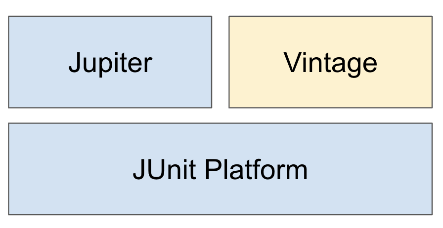
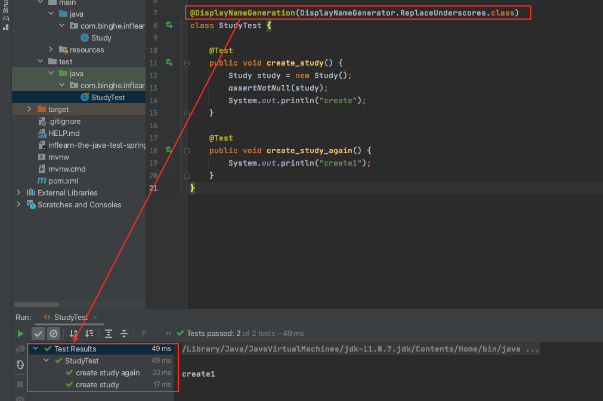
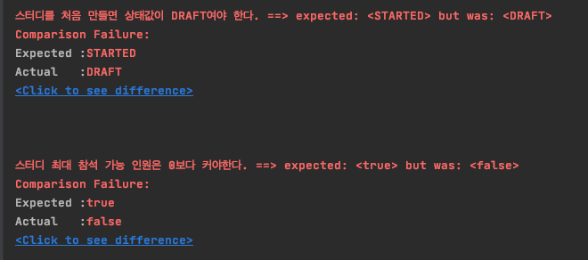
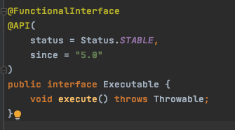
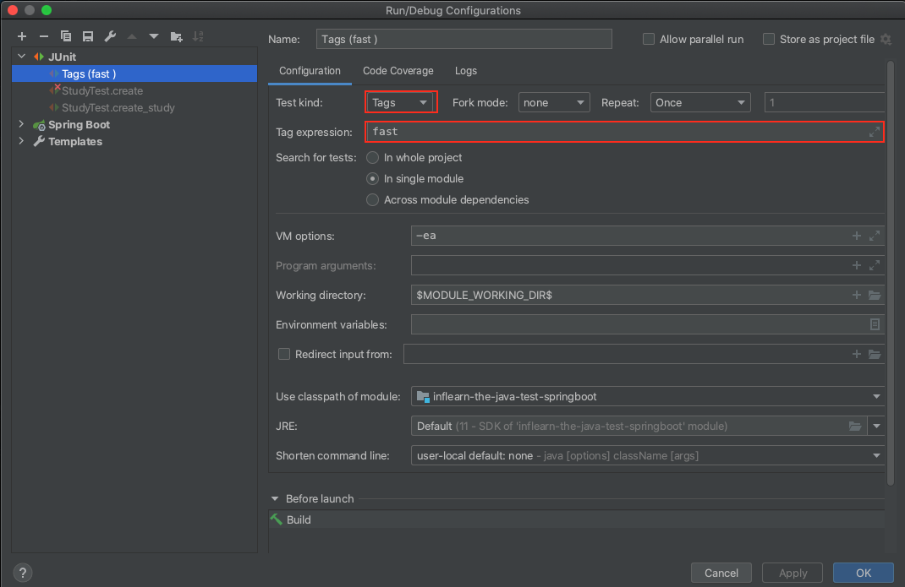
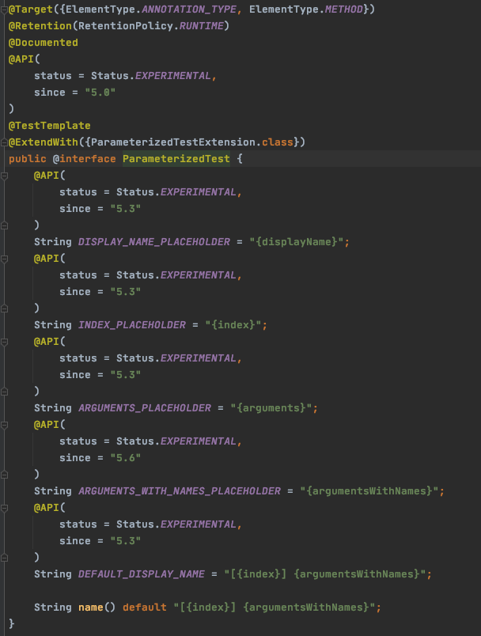
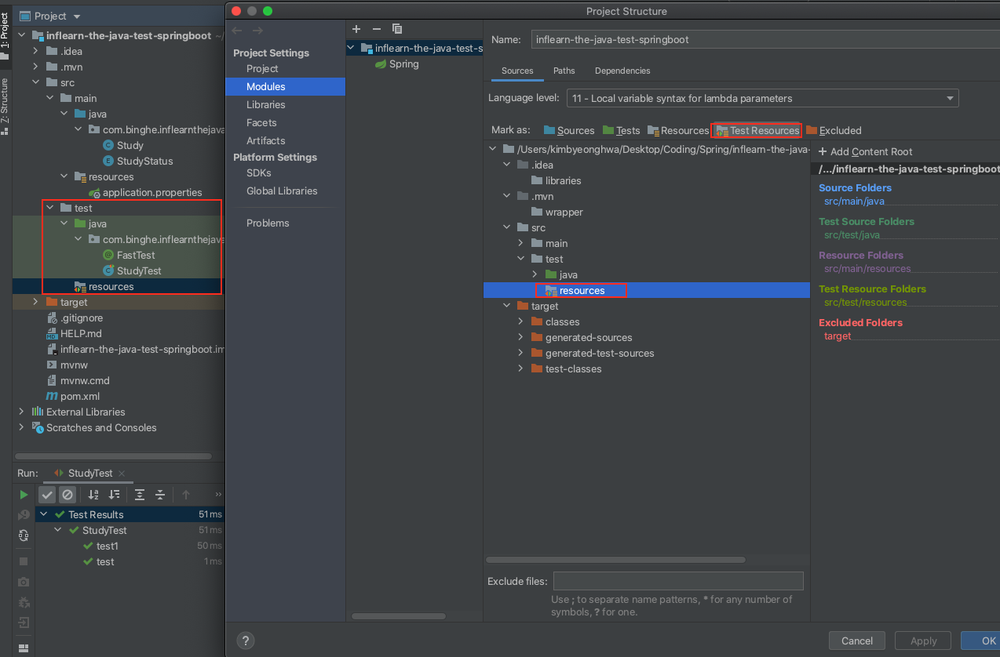

>  [더 자바, 애플리케이션을 테스트하는 다양한 방법 - 백기선님]()강의와 [JUnit User Guide]()를 바탕으로 작성된 글입니다.


# 목차

- [JUnit 5](#junit-5)
  * [1 JUnit란](#1-junit란)
    + [1-1 JUnit 5 달라진 점](#1-1-junit-5-달라진-점)
  * [2 JUnit 5 시작하기](#2-junit-5-시작하기)
    + [2-1 스프링 부트 프로젝트](#2-1-스프링-부트-프로젝트)
    + [2-2 스프링 부트 프로젝트 아닌 경우](#2-2-스프링-부트-프로젝트-아닌-경우)
  * [3 기본 애노테이션](#3-기본-애노테이션)
    + [@Test](#-test)
    + [@BeforeAll / @AfterAll](#beforeall--afterall)
    + [@BeforeEach / @AfterEach](#beforeeach--aftereach)
    + [@Disabled](#disabled)
  * [4 테스트 이름 표기하는 방법](#4-테스트-이름-표기하는-방법)
    + [@DisplayNameGeneration](#displaynamegeneration)
    + [@DisplayName](#displayname)
  * [5 Assertion](#5-assertion)
    + [5-1 Assertion 목록](#5-1-assertion-목록)
    + [5-2 Message](#5-2-message)
    + [5-3 assertAll](#5-3-assertall)
      - [assertAll을 사용하지 않으면](#assertall을-사용하지-않으면)
      - [assertAll를 사용하면](#assertall를-사용하면)
    + [5-4 assertThrows](#5-4-assertthrows)
    + [5-5 assertTimeout](#5-5-asserttimeout)
      - [assertTimeout](#asserttimeout)
      - [assertTimeoutPreemptively](#asserttimeoutpreemptively)
  * [6 조건에 따라 테스트 실행하기](#6-조건에-따라-테스트-실행하기)
    + [6-1 assumeTrue](#6-1-assumetrue)
    + [6-2 assumingThat](#6-2-assumingthat)
    + [6-3 애노테이션을 사용한 assumption](#6-3-애노테이션을-사용한-assumption)
  * [7 태깅과 필터링](#7-태깅과-필터링)
  * [8 커스텀 태그](#8-커스텀-태그)
  * [9 테스트 반복하기](#9-테스트-반복하기)
    + [9-1 @RepeatedTest](#9-1-repeatedtest)
    + [9-2 @ParameterizedTest](#9-2-parameterizedtest)
  * [10 테스트 인스턴스](#10-테스트-인스턴스)
  * [11 테스트 순서](#11-테스트-순서)
  * [12 JUnit 설정](#12-junit-설정)
  * [13 확장 모델](#13-확장-모델)
    + [13-1 확장팩 만드는 방법](#13-1-확장팩-만드는-방법)
    + [13-2 예제](#13-2-예제)


# JUnit 5


## 1 JUnit란

🤔 **JUnit이란?**

* **The JUnit Platform serves as a foundation for launching testing framworks on the JVM.**
* JUnit은 **자바 8이상**부터 제공하는 단위 테스팅 **프레임워크**이다.
* TMI
  * 스프링 부트 2.2부터 디폴트로 JUnit 5를 채택해서 사용되고 있다.


### 1-1 JUnit 5 달라진 점



* **모듈화**

  * 기존 JUnit

    * 기존엔 하나의 `JAR`파일로 의존성을 불러와 다른 라이브러리를 참조하여 사용하는 구조

  * JUnit5

    * Unlike previous versions of JUnit, JUnit 5 is composed of several different modules from three different sub-projects.

    * **JUnit 5 = JUnit Platform + JUnit Jupiter + JUnit Vintage**

    * JUnit 5 부터는 자체적인 여러 모듈이 생겨났다. 

      * `Platform` : 테스트를 실행해주는 런처 제공. `TestEngine API` 제공
      * `Jupiter` : `TestEngine API` 구현체. (JUnit 5를 제공)
      * `Vintage` : JUnit 4와 3을 지원하는 `TestEngine` 구현체

      

## 2 JUnit 5 시작하기

💁‍♂️ **JUnit를 시작하는 방법**

* 스프링 부트 프로젝트
* 스프링 부트 프로젝트를 사용하지 않는 방법


### 2-1 스프링 부트 프로젝트

💁‍♂️ **스프링 부트 프로젝트는 2.2버전 이상부터는 기본적으로 JUnit 5 의존성이 추가가 된다.**


### 2-2 스프링 부트 프로젝트 아닌 경우

[Maven Repository - JUnit Jupiter Engine](https://mvnrepository.com/artifact/org.junit.jupiter/junit-jupiter-engine)

```xml
<dependency>
    <groupId>org.junit.jupiter</groupId>
    <artifactId>junit-jupiter-engine</artifactId>
    <version>5.6.2</version>
    <scope>test</scope>
</dependency>
```

* 위와 같이 의존성을 추가해주면 된다.


## 3 기본 애노테이션

> Jupiter가 제공하는 전체적인 애노테이션은 [UserGuide](https://junit.org/junit5/docs/current/user-guide/#writing-tests-annotations)참고

💁‍♂️ **JUnit Jupiter는 아래와 같은 기본적인 애노테이션을 제공한다.** 


### @Test

* 개념
  * 테스트 메서드라는 것은 나타내는 애노테이션
* 주의 할 점
  * JUnit 4와 다르게 Jupiter는 자체적으로 정의된 애노테이션에 기초하여 동작하기 때문에 `@Test`는 어떠한 속성도 선언하지 않는다. 


>  테스트 메서드 : `@Test`, `@RepeatedTest`, `@ParameterizedTest`, `@TestFactory`


### @BeforeAll / @AfterAll

* 개념
  * `@BeforeAll` : 해당 클래스에 위치한 **모든 테스트 메서드 실행 전**에 딱 한번 실행되는 메서드.
    * Junit 4의 `@BeforeClass`와 유사하다.
  * `@AfterAll` : 해당 클래스에 위치한 **모든 테스트 메서드 실행 후**에 딱 한번 실행되는 메서드.
* 주의 할 점
  * "클래스 단위" 테스트 인스턴스 라이프사이클을 사용하지 않는 한,  **꼭 `static`으로 선언해줘야 한다.** 


### @BeforeEach / @AfterEach

* 개념
  * `@BeforeEach` : 해당 클래스에 위치한 **매 테스트 메서드 실행 전**에 실행되는 메서드. 
    * JUnit 4의 `@Before`와 유사하다.
  * `@AfterEach` : 해당 클래스에 위치한 **매 테스트 메서드 실행 후**에 실행되는 메서드. 
    * Junit 4의 `@After`와 유사하다.
* 주의 할 점
  * JUnit 4와 똑같이 매 테스트 메서드마다 새로운 클래스를 생성(new)하여 실행된다.
    * **즉,  JDBC의 커넥션을 `@BeforeEach`에서 생성한다고 가정하면, 매 테스트 케이스마다 생성된다. (비효율적)**


### @Disabled

* 개념
  * 테스트를 하고 싶지 않은 클래스나 메서드에 붙이는 애노테이션
    * JUnit 4의 `@Ignore`과 유사하다.


## 4 테스트 이름 표기하는 방법

💁‍♂️ **테스트 클래스나 메서드에 띄워쓰기, 이모지, 특수문자등을 사용해서 커스텀 이름을 지정할 수 있다.**

* 테스트 코드를 실행하면 결과창에 테스트 클래스와 메서드의 이름이 출력된다. **기본값을 클래스와 메서드의 이름이다.**


### @DisplayNameGeneration

* 개념
  * Method와 Class 래퍼런스를 사용해서 **테스트 이름을 표기하는 방법(전력)을 설정**
  * 기본 구현제로 `ReplaceUnderscores`를 제공한다. (`_`를 자동적으로 띄워쓰기해서 출력해준다.)
* 예제




### @DisplayName

* 개념
  * 어떤 테스트인지 테스트 이름을 보다 쉽게 표현할 수 있는 방법을 제공하는 애노테이션
  * `@DisplayNameGeneration` 보다 우선 순위가 높다.
  * **띄워쓰기, Emoji, 특수문자등을 모두 지원한다.**
* 예제

```java
@Test
@DisplayName("테스트 이름!!!")
public void create_study_again() {
  System.out.println("create1");
}
```


## 5 Assertion

🤔 **Assertion이란?**

* 사전적 의미 : 주장, 행사
* 테스트 케이스의 수행 결과를 판별하는 메서드이다.
  * 오직 실패한 Assertions만 기록된다.
* 모든 `JUnit Jupiter Assertions`는 `static` 메서드이다. (`org.junit.jupiter.api.Assertions`)
* `JUnit Jupiter`가 제공하는 기능.
  * 그 외에도 `AssertJ`, `Hemcrest`, `Truth`등의 서드파티 라이브라리를 사용할 수도 있다.


💁‍♂️ JUnit 5부터는 JAVA 8, 특히 람다 표현식의 새로운 기능들의 전체 장점을 끌어올렸다.


### 5-1 Assertion 목록

> 모든 `Assertion`은 [JUnit 레퍼런스](https://junit.org/junit5/docs/current/api/org.junit.jupiter.api/org/junit/jupiter/api/Assertions.html)를 참고하면 된다.

| 메서드                                   | 의미                                  |
| ---------------------------------------- | ------------------------------------- |
| `assertEquals(expected, actual)`         | 실제 값이 기대한 값과 같은지 확인     |
| `assertNotNull(actual)`                  | 값이 `null`이 아닌지 확인             |
| `assertTrue(boolean)`                    | 다음 조건이 참(true)인지 확인         |
| `assertAll(executables...)`              | 모든 확인 구문 확인                   |
| `assertThrows(expectedType, executable)` | 예외 발생 확인                        |
| `assertTimeout(duration, executable)`    | 특정 시간 안에 실행이 완료되는지 확인 |


### 5-2 Message

> `assertEquals`를 통해 `Message`를 알아보자.

💁‍♂️ **`assertEquals`는 오버로딩 메서드이다.**

* ```java
  public static void assertEquals(Object expected, Object actual)
  ```

  * 제일 기본인 `assertEquals`.

* ```java
  public static void assertEquals(Object expected, Object actual, String message)
  ```

  * 실패시 출력하고 싶은 `message`를 뒤에 붙여준다.
  * 단 `String`의 메시지는 **실패와 상관없이 문자열 연산이 되지만, 실패시에만 출력이 된다. (낭비)**
    * 문자열 연산 : `"기대되는 값은" + expect + "입니다."`

* ```java
  public static void assertEquals(Object expected, Object actual, Supplier<String> messageSupplier)
  ```

  * 람다 표현식의 기본 인터페이스인 `Supplier`를 통해 문자열을 정의해주면 **실패시에만 해당 문자열 연산을 한다.**
    * 즉, 일반적인 `String message`보다 성능적 향상이 있다.


:point_right: **예시**

```java
// Study 객체의 상태를 표시하는 enum
public enum StudyStatus {
    DRAFT, STARTED, ENDED
}

// Study 객체
public class Study {

    private StudyStatus status;

    public StudyStatus getStatus() {
        return status;
    }
}

class StudyTest {
    @Test
    public void create_study() {
        Study study = new Study();
        assertNotNull(study);
        assertEquals(StudyStatus.DRAFT, study.getStatus(), "Study의 생성하면 상태는 DRAFT.");
    }
}
```


### 5-3 assertAll

🤔 **assertAll**

```java
public static void assertAll(Executable... executables) throws MultipleFailuresError
```

* **In a grouped assertion all assertions are executed, and all failures will be reported together.**
* 매개변수로 받는 모든 테스트 코드(`Executable`)를 한번에 실행해준다.


#### assertAll을 사용하지 않으면

```java
@Test
public void create_study() {
  Study study = new Study();
  assertNotNull(study);
  assertEquals(StudyStatus.STARTED, study.getStatus(), "스터디를 처음 만들면 상태값이 DRAFT");
  assertTrue(study.getLimit() > 0, () -> "스터디 최대 참석 가능 인원은 0보다 커야한다.");
}
// 결과
Failed : assertEquals
```

* **만약 `assertEquals(...)`에서 `Failed`가 떠버리면 `assertTrue(..)`는 테스트도 하지 않고 테스트 메서드가 끝나버린다.**


#### assertAll를 사용하면

```java
@Test
public void create_study() {
  Study study = new Study();
  assertAll(
    () -> assertNotNull(study),
    () -> assertEquals(StudyStatus.STARTED, study.getStatus(),"스터디를 처음 만들면 상태값DRAFT"),
    () -> assertTrue(study.getLimit() > 0, "스터디 최대 참석 가능 인원은 0보다 커야한다.")
  );
}
```



* **`assertEquals`가 `Failed`해도 다음 테스트를 실행하는 것을 볼수 있다.**


> 🤔 **Executable이란?**
>
> 
>
> * `Executable` is a functional interface that can be used to implement any generic block of code that potentially throws a `Throwable`.
> * The `Executable` interface is similar to `Runnable`, except that an `Executable` can throw any kind of exception.
> * 잠재적으로 예외를 던질 수 있는 아무 실행 코드를 구현한 함수형 인터페이스.


### 5-4 assertThrows

🤔 **assertThrows**

```java
public static <T extends Throwable> T assertThrows(Class<T> expectedType, Executable executable)
```

* 예외 발생 테스트.
* **인자로 받는 `executable`의 로직이 실행하는 도중 `expectedType`의 에러를 발생시키는지 확인하는 메서드이다.**


:point_right: **예시**

```java
public class Study {
    private int Limit = -10;

    public Study(int limit) {
        if(limit < 0){
            throw new IllegalArgumentException("limit은 0보다 커야한다.");
        }
    }
}

@Test
public void create_study() {
  // 예외가 발생하는지 테스트하고 던져지는 예외 e에 저장.
  IllegalArgumentException e = assertThrows(IllegalArgumentException.class, 
                                            () -> new Study(-10));
  // 예외의 메시지가 기대 했던 메시지와 같은지 테스트.
  assertEquals("limit은 0보다 커야한다.", e.getMessage());
}
```


### 5-5 assertTimeout


#### assertTimeout

🤔 **assertTimeout**

```java
public static void assertTimeout(Duration timeout, Executable executable)
```

* 특정 시간 안에 실행이 완료되는지 확인
  * `timeout` : 원하는 시간
  * `executable` : 테스트할 로직
* 단점
  * 테스트 로직(`executable`)이 끝나고 `timeout`과 시간을 비교하여 결과를 반환한다.
  * 즉, 테스트 로직이 끝날때까지 성공 여부를 모른다. (시간 낭비)


:point_right: **예시**

```java
@Test
public void create_study() {
  // 시간안에 테스트를 끝마치는지 테스트
  assertTimeout(Duration.ofMillis(300), () -> {
    // 아래 로직이 300밀리세컨드 안에 끝나는지를 테스트.
    Study study = new Study(10);
    Thread.sleep(300);
  });
}
```


#### assertTimeoutPreemptively

🤔 **assertTimeoutPreemptively**

```java
public static void assertTimeoutPreemptively(Duration timeout, Executable executable)
```

* Preemptively : 즉각적인
* **원하는 시간 (`timeout`)이 지나면 바로 결과를 반환해준다.**


:point_right: **예시**

```java
@Test
public void create_study() {
  assertTimeoutPreemptively(Duration.ofMillis(300), () -> {
    Study study = new Study(10);
    Thread.sleep(300);
  });
}
```


>  주의 할 점
>
> * `assertTimeoutPreemptively`은 별개의 Thread를 생성해서 `executable`를 실행한다.
> * 만약 `ThreadLocal`전략을 사용하는 로직이라면 예상치 못한 결과가 나올 수 있다. (ex. Spring 트랜잭션)


## 6 조건에 따라 테스트 실행하기

💁‍♂️ **테스트 코드를 특정한 조건에 따라 실행하게 하거나 실행되지 않도록 할 수 있다.**

* 특정 OS
* 특정 자바 버전
* 특정 시스템 변수, 환경 변수 등등


🤔 **Assumptions란?**

* 사전적 의미 : 추정, 상정
* `Assumptions` is a collection of utility methods that support conditional test execution based on *assumptions*.


### 6-1 assumeTrue

🤔 **assumeTrue란?**

* 주어진 true라면 실행, false라면 실행은 끝낸다.


:point_right: 예시

```java
@Test
public void create_study() {
  // assumtion 테스트
  String test_env = System.getenv("TEST_ENV");// TEST_ENV라는 환경 변수를 가져오는 코드
  System.out.println(test_env);
  assumeTrue("LOCAL".equalsIgnoreCase(test_env));

  // 실행 조차 안된다.
  Study actual = new Study(10);
  assertTrue(actual.getLimit() > 0);
}
```

* 환경 변수에 `TEST_ENV`의 값이 `LOCAL`이 아니면 테스트 코드를 종료시킨다.


### 6-2 assumingThat

🤔 **assumingThat란?**

* 조건문 처럼 어떠한 조건에 있을 경우 테스트를 실행하게 할 수 있는 메서드.


:point_right: **예시**

```java
@Test
public void create_study() {
  String test_env = System.getenv("TEST_ENV");// TEST_ENV라는 환경 변수를 가져오는 코드
  assumeTrue("LOCAL".equalsIgnoreCase(test_env));
  
  // TEST_ENV의 환경변수가 LOCAL이면 실행되는 코드
  assumingThat("LOCAL".equalsIgnoreCase(test_env), () -> {
    System.out.println("null");
    Study actual = new Study(10);
    assertTrue(actual.getLimit() > 0);
  });
}
```


### 6-3 애노테이션을 사용한 assumption

* `@EnabledOnOS()` : 주어진 OS인 경우 실행

  * ```java
    @Test
    @DisplayName("스터디 만들기")
    @EnabledOnOs(OS.MAC)
    void create(){
      ...
    }
    ```

* `@DisabledOnOs()` : 주어진 OS인 경우 실행 안함

* `@EnableOnJre()` : 주어진 JRE버전에서는 실행.

* `@EnabledEnvironmentVariable("TEST_ENV", matches = "LOCAL")` : 주어진 확정 변수의 값일 때 실행


## 7 태깅과 필터링

🤔 **테스트 태깅이란?**

* 테스트에 태그를 다는 것을 말한다.
* 여러 테스트를 그룹화하는 것을 의미한다. 
  * 모듈별
  * 단위 테스트
  * 통합 테스트
  * 시간 - 오래 걸리는지, 얼마 안걸리는지 등등


:point_right: **예시**

`테스트 코드에 태그를 붙여준다`

```java
@Test
@Tag("fast")
void fast_create() {
  ...
}

@Test
@Tag("slow")
void slow_create(){
  ...
}
```

`특정 태그의 테스트만 실행`



* 특정 태그 (`fast`)를 가진 테스트 코드만 실행을 한다.


## 8 커스텀 태그

🤔 **커스텀 태그**

* 여러 개의 JUnit 애노테이션을 조합해서 하나의 커스텀 애노테이션으로 만들 수 있다.
* 특징
  * 기존의 JUnit 애노테이션을 담은 커스텀 애노테이션을 만들 수 있다.


:point_right: **예시**

```java
@Target(ElementType.METHOD)
@Retention(RetentionPolicy.RUNTIME)
@Test // @Test를 포함하고 있다.
@Tag("fast") // @Tag('fast')를 포함하고 있다.
public @interface FastTest {
}

@FastTest
public void create_study() {
  Study actual = new Study(10);
  assertTrue(actual.getLimit() > 0);
}
```

* `@FastTest`안에 `@Test`와 `@Tag`를 포함하고 있다.


## 9 테스트 반복하기

🤔 **테스트 반복**

* 특정 테스트를 반복시키고 싶으면 사용하면 된다.


### 9-1 @RepeatedTest

🤔 **RepeatedTest**


* 반복 횟수와 반복 테스트 이름을 설정할 수 있다.
  * value : 반복 횟수
  * name : 반복때마다 테스트의 이름
    * {displayName} : 테스트하는 메서드나 클래스의 이름
    * {currentRepetition} : 현재 반복 횟수
    * {totalRepetitions} : 전체 반복 횟수
* RepetitionInfo 타입의 인자를 받을 수 있다.


:point_right: **예시**

```java
@RepeatedTest(10)
void repeat_create_study(){
  System.out.println("test");
}

@RepeatedTest(value = 10, name = "{currentRepetition}/{totalRepetitions}")
void repeat_create_study(RepetitionInfo repetitionInfo){
  System.out.println("test" + repetitionInfo.getCurrentRepetition() + "/"
                     + repetitionInfo.getTotalRepetitions());
}
```

* `RepetitionInfo`
  * 반복 관련된 메타 데이터
    * 현재 반복 횟수
    * 전체 반복 횟수


### 9-2 @ParameterizedTest

🤔 **ParameterizedTest**



* 테스트에 **여러 다른 매개변수를 대입해가며 반복 실행**한다.
  * {displayName}
  * {index}
  * {arguments}
  * {0}, {1}, ...
* `ParameterizedTest`는 여러 많은 애노테이션을 수용한다.
  * `ValueSource` : 특정한 매개변수를 넘겨줄 수 있다. (단 하나의 자료형에 한해서)
  * `@EmptySource` : 테스트 마지막에 비어있는 (`""`) 값을 매개변수로 가진 테스트를 실행한다.
  * `@NullSource` :  테스트 마지막에 `null`값을 매개변수로 가진 테스트를 진행한다.
  * `@CvsSource` : 여러 타입의 매개변수를 넘겨줄 수 있다.
  * `@ArgumentSource`
  * `@EnumSource`
  * `@MethodSource`


:point_right: **예시**

```java
@DisplayName("테스트 반복")
@ParameterizedTest(name = "{index} {displayName} : {0}")
@ValueSource(strings = {"안녕하세요", "테스트", "코드", "열심히", "공부해야죠"})
@EmptySource
@NullSource
void parameterizedTest(String message){
  System.out.println(message);
}
// 결과
1 테스트 반복 : 안녕하세요
2 테스트 반복 : 테스트
...
```

* 첫번째 테스트는 `안녕하세요`를 가지고 테스트를 진행한다.
* 두번째 테스트는 `테스트`를 가지고 테스트를 진행한다.
* ...


> `ValueSource`는 String뿐만 아니라 다양한 자료형의 데이터를 넘겨줄 수 있다.


## 10 테스트 인스턴스

💁‍♂️ **JUnit의 기본 전략**

* **모든 테스트 메서드는 해당 클래스의 새로운 인스턴스를 생성하여 실행한다.**
  * 그 이유는 각 테스트마다의 의존성을 없애기 위해서다. 즉 테스트의 순서에 의존하지 않기 위해서.
  * 단위 테스트이므로 단위별로 서로 영향을 끼쳐서는 안된다.


💁‍♂️ **JUnit 5에서는 기존의 JUnit의 전략을 변경할 수 있게 되었다. == `@TestInstance()`**

* `@TestInstance`
  * 테스트 전략을 변경할 수 있게 해준다.
* **특징**
  * 경우에 따라, 테스트 간에 공유하는 모든 상태를 `@BeforeEach`또는 `@AfterEach`에서 초기화 할 필요가 있다.
  * **`PER_CLASS`의 테스트 클래스에서는 `@BeforeAll`과 `@AfterAll`모두 `static`을 붙여줄 필요가 없다.**
* **예시**
  * `@TestInstance(TestInstance.Lifecycle.PER_CLASS)` : 하나의 클래스만 만들어 모든 테스트 메서드를 실행
  * `@TestInstance(TestInstance.Lifecycle.PER_METHOD)` : 기존 전략대로 매 메서드마다 새로운 인스턴스 생성.


:point_right: **예시**

```java
@TestInstance(TestInstance.Lifecycle.PER_CLASS)
class StudyTest {
  int value = 1;

  @Test
  void test() {
    System.out.println(this);
    System.out.println(value);
    value++;
  }

  @Test
  void test1(){
    System.out.println(this);
    System.out.println(value);
    value++;
  }
}

// 결과
com.binghe.inflearnthejavatestspringboot.StudyTest@55183b20
1
com.binghe.inflearnthejavatestspringboot.StudyTest@55183b20
2
```

* 클래스가 하나만 만들어 진 것을 볼 수 있다.


## 11 테스트 순서

💁‍♂️ **실행할 테스트 메서드 특정한 순서에 의해 실행되지만 어떻게 그 순서를 정하는지는 의도적으로 분명히 하지 않는다.**

* 테스트 인스턴스를 테스트마다 새로 만드는 것과 같은 이유이다.
* 또한, 단위 테스트이므로 각 테스트가 서로 독립적이여야하며 영향을 끼쳐서는 안된다.


💁‍♂️ **하지만, 경우에 따라 특정 순서대로 테스트를 실행하고 싶을 때도 있다.** 

* 회원 가입 -> 로그인 -> 개인 페이지 -> 비밀번호 수정등과 같이 순서대로 테스트를 실행하고 싶은 경우
* **시나리오 (유스케이스) 테스트**할 때 유용하다.


💁‍♂️ **이 경우에는 테스트 메서드를 원하는 순서에 따라 실행하도록 `@TestMethodOrder`를 사용할 수 있다.**

* `MethodOrderer` 구현체를 설정한다.
* 기본 구현체
  * `Alphanumeric`
  * `OrderAnnotation`
  * `Random`


:point_right: **예시**

```java
@TestMethodOrder(MethodOrderer.OrderAnnotation.class)
class StudyTest {

  @Test
  @Order(2)
  void test() {
    System.out.println("로그인");
  }

  @Test
  @Order(1)
  void test1(){
    System.out.println("회원가입");
  }
}
// 결과
회원가입
로그인
```

* `Order`를 통해 순서를 정할 수 있다.
  * **스프링에도 `Order`가 있기 때문에 헷갈리지 말고 JUnit의 `Order`를 쓰자.**


## 12 JUnit 설정

> **JUnit 설정파일은 클래스패스 루트 (`src/test/resources/`)에 넣어두면 적용된다.**

💁‍♂️ **JUnit은 `junit-platform.properties`를 통해 설정을 변경할 수 있다.**

* 테스트 인스턴스 라이프사이클 설정
  * `junit.jupiter.testinstance.lifecycle.default = per_class`
* 확장팩 자동 감지 기능 (기본값:`false`)
  * `junit.jupiter.extensions.autodetection.enabled = true`
* `@Disabled` 무시하고 실행하기
  * `junit.jupiter.confitions.deactivate = org.junit.*DisabledCondition`
* 테스트 이름 표기 전략 설정
  * `junit.jupiter.displayname.generator.default=org.junit.jupiter.api.DisplayNameGenerator&ReplaceUnderscored`


> * 모든 테스트에 일괄적으로 적용하고 싶은 설정에 대해서 설정해주면 된다.
> * 설정 파일의 클래스패스 루트 정하는 방법
>   * 


## 13 확장 모델

> [JUnit 5 - extentions](https://junit.org/junit5/docs/current/user-guide/#extensions)에 가면 더 자세히 볼 수 있다.

💁‍♂️ **JUnit 4와 JUnit 5의 확장 모델**

* JUnit 4의 확장 모델 : `@RunWith(Runner)`, `TestRule`, `MethodRule`
* JUnit 5의 확장 모델은 단 하나 : `Extension`


💁‍♂️ **확장 모델 등록 방법**

* 선언적인 등록 : `@ExtensionWith`
* 프로그래밍 등록 : `@RegisterExtension`
* 자동 등록 자바 [ServiceLoader]()이용


### 13-1 확장팩 만드는 방법

💁‍♂️ **아래 기능들을 사용해서 여러 커스텀 확장팩을 만들 수 있다.**

* 테스트 실행 조건
* 테스트 인스턴스 팩토리
* 테스트 인스턴스 후-처리기
* 테스트 매개변수 리졸버
* 테스트 라이프사이클 콜백
* 예외 처리
* ...


### 13-2 예제

`테스트 메서드의 실행시간이 1초를 넘어가는데 @SlowTest가 없는 테스트를 감지하고 알려주는 Extension`

```java
public class FindSlowTestExtension implements BeforeTestExecutionCallback, AfterTestExecutionCallback {

    private static final long THRESHOLD = 1000L; // 1초

  	// Test(메서드)를 실행하기 전에
    @Override
    public void beforeTestExecution(ExtensionContext extensionContext) throws Exception {
        String testClassName = extensionContext.getRequiredTestClass().getName();
        String testMethodName = extensionContext.getRequiredTestMethod().getName();
      	// 확장팩 Context Store에 시작 시간 저장
        ExtensionContext.Store store = extensionContext.getStore(ExtensionContext.Namespace.create(testClassName, testMethodName));
        store.put("START_TIME", System.currentTimeMillis());
    }

  	// Test(메서드)를 실행하고 나서
    @Override
    public void afterTestExecution(ExtensionContext extensionContext) throws Exception {
        // Reflection을 사용하여 이미 메서드에 SlowTest 애노테이션이 존재한다면 continue
        Method requiredTestMethod = extensionContext.getRequiredTestMethod();
        SlowTest annotation = requiredTestMethod.getAnnotation(SlowTest.class);

      	// 확장팩 Context Store에 저장되어 있는 시작 시간 꺼내서 실행 시간 체크
        String testClassName = extensionContext.getRequiredTestClass().getName();
        String testMethodName = extensionContext.getRequiredTestMethod().getName();
        ExtensionContext.Store store = extensionContext.getStore(ExtensionContext.Namespace.create(testClassName, testMethodName));
        long start_time = (long) store.remove("START_TIME");
        long duration = System.currentTimeMillis() - start_time; // 메서드 실행 시간.
      
	      // 1초 이상걸리는 테스트인데 @SlowTest가 없는 경우
        if(duration > THRESHOLD && annotation == null){ 
            System.out.printf("Please consider mark method [%s] with @SlowTest.\n", testMethodName);
        }
    }
}
```

`테스트 클래스에 선언적인 등록`

```java
@TestMethodOrder(MethodOrderer.OrderAnnotation.class)
@ExtendWith(FindSlowTestExtension.class)
class StudyTest {

    int value = 1;

    @Test
    @Order(2)
    @SlowTest
    void test() throws InterruptedException {
        System.out.println("로그인");
        Thread.sleep(1005);
    }

    @Test
    @Order(1)
    void test1(){
        System.out.println("회원가입");
    }
}
// 결과는 정상적으로 작동한다. test가 1초이상 걸리긴 하지만 이미 @SlowTest가 있으므로.
```


🤔 **만약 확장팩에 생성자를 통해 값을 넘기고 싶다면?**

* `@RegisterExtion`을 사용해서 필드에 `FindSlowTestExtension`을 생성해주면 된다.

