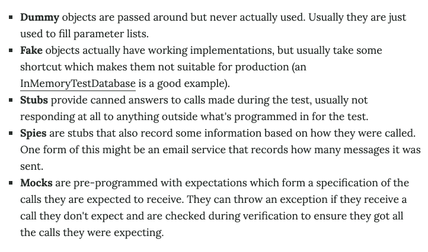
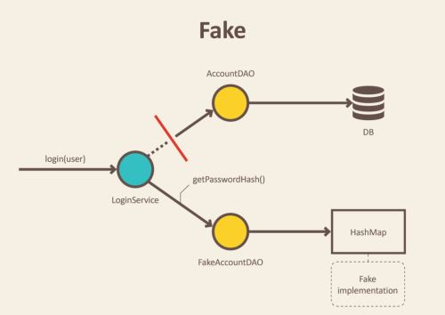
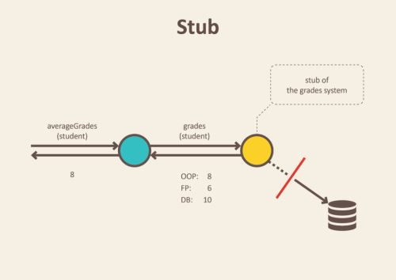
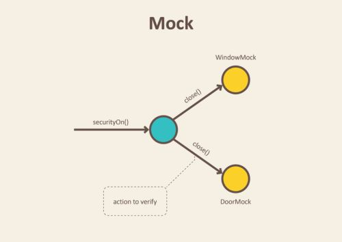

# 목차

<br>

- [목차](#목차)
- [테스트 더블이란?](#테스트-더블이란)
- [테스트 더블 종류](#테스트-더블-종류)
  - [Dummy](#dummy)
  - [Fake](#fake)
  - [Stubs](#stubs)
  - [Spy](#spy)
  - [Mocks](#mocks)
- [Stub vs Mock](#stub-vs-mock)
  - [상태 검증과 행위 검증](#상태-검증과-행위-검증)
  - [둘의 차이점은 무엇일까](#둘의-차이점은-무엇일까)
- [참고](#참고)

<br>

# 테스트 더블이란?
제라드 메스자로스 (Gerard Meszaros)가 프로젝트를 진행하며, 어색했던 일 중 하나가 바로 사람들이 테스트를 위해 시스템의 일부를 대체하는데 사용하는 Stub, Mock, Fake, Dummy 및 기타 항목에 대한 다양한 이름이라고 한다.

그래서 제라드 메스자로스가 테스트 더블이란 일반적인 용어를 생각해냈다.

즉, 테스트 더블이란 테스트 목적으로 프로덕션 객체를 대체하는 모든 경우에 대한 일반적인 용어다.

> 테스트 더블이란 용어는 영화 촬영 시 위험한 역할을 대신하는 스턴트 더블에서 비롯되었다고 한다.


<br>

# 테스트 더블 종류

<p align="center"><br>출처: https://martinfowler.com/bliki/TestDouble.html</p>

<br>

## Dummy

🤔 **Dummy란?**
* 가장 기본적인 테스트 더블이다.
* **객체가 전달되지만 사용되지 않는 객체다.**
  * 보통 매개변수 목록을 채우는 데만 사용된다.
  * **동작하지 않아도 테스트에는 영향을 미치지 않는 테스트 객체.**
* 정말 말 그대로 모조 객체. 객체인 척만 한다.
  * **테스트 핵심 로직과는 상관 없는 객체.**

<br>

:point_right: **예시**

현재 서비스 테스트에 상관 없는 로깅 의존성이 있다고 가정해보자.
```java
public interface Logger {
    void append(String text);
}

public class Service {
    private Logger logger;

    ... 핵심 로직
}
```

그렇다면, 아래와 같이 Dummy 객체를 만들어서 해당 테스트에서 사용하면 된다.

```java
public class DummyLogger implements Logger {
    @Override
    public void append(String text) {...}
}
```

**위처럼 동작하지 않아도 테스트에는 영향을 미치지 않는 객체를 더미 객체라 한다.**


<br>

## Fake
<p align="center"><br>출처: https://www.softwaretestingmagazine.com/knowledge/unit-testing-fakes-mocks-and-stubs/</p>

<br>

🤔 **Fake란?**

* Fake 객체는 실제 동작의 구현을 가지고 있지만, 실제 프로덕션에는 적합하지 않는 객체를 의미한다.
  * ex. InMemoryTestDatabase
* 동작은 하지만 실제 사용되는 객체처럼 정교하게 동작하지 않는 객체.

<br>

:point_right: **예시**

DB와 연결해야 하는 테스트를 해야한다고 가정해보자.

실제 DB와 연결해도 되지만, DB 실제 연결보다는 다른 로직에 집중한 테스트가 있다.

그렇다면 다음과 같이 DB에 실제 연결한 것처럼 동일한 역할을 하는 Fake 객체를 만들어 주입해줄 수 있다.
```java
interface UserRepository {
    User getUserById(String id);
}

// Fake 객체
class FakeUserRepository implements UserRepository {
    @Override
    public User getUserById(String id) {
        return new User(id, "binghe");
    }
}
```
위와 같이 Fake 객체는 실제 객체와 동일한 역할을 하도록 만들되 테스트에서만 사용되는 객체를 의미한다.

<br>

## Stubs

<p align="center"><br> 출처: https://www.softwaretestingmagazine.com/knowledge/unit-testing-fakes-mocks-and-stubs/</p>

<br>

🤔 **Stub란?**

* 테스트 중에 호출될 요청에 대한 결과를 미리 준비해서 제공한다.
  * 즉, 테스트를 위해 프로그래밍된 내용에 대해서만 준비된 결과를 제공한다.
  * 상태 검증을 통해 테스트한다.
* 쉽게 말해 인터페이스 또는 기본 클래스가 최소한(준비된 결과만)으로 구현된 상태다.

<br>

:point_right: **예시**

Fake 객체에서의 `UserRepository`는 `findById()`를 호출하면 항상 동일한 `User`객체를 반환했다.

하지만 아래와 같이Stub을 사용한다면 테스트 환경에서 상황 별로 어떤 값을 넘기면 어떠한 결과가 나온다는 설정을 할 수 있다.

`when(userRepository.findById(1L)).thenReturn(user);`

그리고 assert를 통해 상태 검증을 한다.

<br>

> [Mockito](https://github.com/binghe819/TIL/blob/master/Test/Mockito/Mockito.md)는 Stub와 같은 역할을 해주는 Mock 객체를 쉽게 만들 수 있게 도와준다.

<br>

## Spy

🤔 **Spy란?**

* **어떻게 호출되는냐에 따라 일부 정보를 기록하는 Stub이다.**
  * **Stub의 역할을 하면서 호출된 내용에 대한 정보를 기록한다.**
  * ex. 이메일 서비스를 목킹할 때 전송된 메시지 수를 기록할 때 사용할 수 있다.
* 실제 객체처럼 동작시킬 수도 있고, 필요한 부분에 대해서는 Stub으로 만들어서 동작을 지정할 수 있다.
  * 즉, 실제 객체로도 사용할 수 있고, Stub 객체로도 활용할 수 있으며 필요한 경우 특정 메서드가 제대로 호출되었는지 여부를 확인할 수 있다.
* **중요한 점은 상태를 가질 수 있다는 것!!**
  * **대표적인 상태 검증 테스트 더블이다.**

<br>

:point_right: **예시**

```java
public class MailService {
    private int sendMailCount = 0;
    private Collection<Mail> mails = new ArrayList<>();

    public void sendMail(Mail mail) {
        sendMailCount++;
        mails.add(mail);
    }

    // getter
}
```
위와 같이 `sendMail`을 호출할 때마다 보낸 메일을 저장하고 몇 번 보냈는지 체크하는 것을 Spy라고 한다.

> [Mockito](https://github.com/binghe819/TIL/blob/master/Test/Mockito/Mockito.md)프레임워크의 `verify()` 메서드가 비슷한 역할을 수행한다고 보면 된다.

<br>

## Mocks
<p align="center"><br>출처: https://www.softwaretestingmagazine.com/knowledge/unit-testing-fakes-mocks-and-stubs/</p>

<br>

🤔 **Mocks란?**

* 호출에 대한 기대를 명세하고 내용에 따라 동작하도록 프로그래밍된 객체를 의미한다.
* **다른 테스트 더블과는 다르게 유일하게 행위 검증 사용을 추구한다.**
  * By object behavior I mean we check that the correct methods and paths are excercised on the object when the test is run.
  * 행위를 기록하는 로직이 존재한다.

<br>

:point_right: **예시**

```java
@Mock
UserRepository userRepository;

UserService userService = new UserService(userRepository);

@Test
void test() {
    // given
    User user = new User(1L, "binghe");

    // mock
    when(userRepository.findById(1L)).thenReturn(user);

    // when
    User findUser = userService.findById(user.getId());

    // then
    verify(userRepository, times(1)).findById(1L);
}
```
**Mock은 위와 같은 Stub도 하고, 행위 검증(`verify`)도 한다.**

<br>

# Stub vs Mock
많은 테스트 더블들이 있지만, 테스트 더블들의 역할이 딱딱 나뉘어져 있지 않는다.

서로가 서로의 특성을 조금씩 포함하며, 대표적으로 stub과 mock만을 구분한다.

> 마틴 파울러는 자신의 블로그에 [Mocks Aren't Stubs](https://martinfowler.com/articles/mocksArentStubs.html)이란 글도 작성했을 정도로 둘을 같은 것으로 착각하는 사람들이 많은 것 같다.

<br>

## 상태 검증과 행위 검증
Stub과 Mock의 차이점을 알아보기 전에 검증에는 어떤 방식이 있는지 알아보자.

<br>

**상태 검증**
```java
TestClass instance = new TestClass();
instance.someMethod();

assertThat(instance.someStatus()).isEqualTo(true);
```
* 상태 검증은 특정 메서드가 수행된 후 **상태를 통해** 올바르게 동작했는지 판단하는 방식이다.

<br>

**행위 검증**
```java
TestClass instance = new TestClass();

verify(instance, times(2)).someMethod();
```
* 행위 검증은 상태 검증과 다르게 특정 메서드가 수행된 후 **행위를 통해** 올바르게 동작했는지 판단하는 방식이다.

<br>

## 둘의 차이점은 무엇일까
* 검증 방식 (가장 중요한 차이점)
  * Mock: 행동 검증
  * Stub: 상태 검증
* 원칙
  * 하나의 테스트는 보통 한 가지의 로직만을 검증한다.
  * Stub: 하나의 테스트안에 여러 개의 stub이 존재한다.
  * Mock: 하나의 테스트안에 보통 하나의 mock만 존재한다.
* 생명주기
  * stub
    * Setup - Prepare object that is being tested and its stubs collaborators.
    * Exercise - Test the functionality.
    * **Verify state** - Use asserts to check object's state. (**상태 검증**)
    * Teardown - Clean up resources.
  * mock
    * Setup data - Prepare object that is being tested.
    * **Setup expectations** - Prepare expectations in mock that is being used by primary object.
    * Exercise - Test the functionality.
    * **Verify expectations** - Verify that correct methods has been invoked in mock. (**행위 검증**)
    * Verify state - Use asserts to check object's state. (**상태 검증**)
    * Teardown - Clean up resources.

<br>

> 정말 쉽게 설명하자면
> * stub: 호출시 미리 답변을 준비하는 정말 간단한 fake 객체. 
> * mock: stub + 행위 검증

<br>

# 참고
* https://martinfowler.com/bliki/TestDouble.html
* https://martinfowler.com/articles/mocksArentStubs.html
* https://www.softwaretestingmagazine.com/knowledge/unit-testing-fakes-mocks-and-stubs/
* https://woowacourse.github.io/tecoble/post/2020-09-19-what-is-test-double/
* https://stackoverflow.com/questions/3459287/whats-the-difference-between-a-mock-stub
* https://sshkim.tistory.com/171
