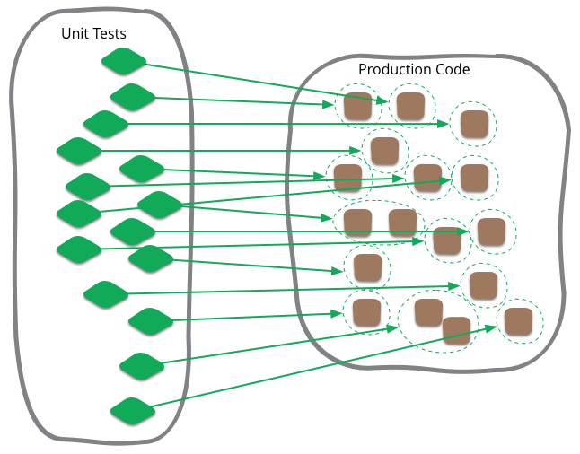

# 목차

 

- [목차](#목차)
- [단위 테스트](#단위-테스트)
  - [단위 테스트란?](#단위-테스트란)
    - [공통적인 의견](#공통적인-의견)
    - [유일한 차이점 - 단위의 기준](#유일한-차이점---단위의-기준)
    - [그외](#그외)
  - [Solitary vs Sociable](#solitary-vs-sociable)
    - [Solitary](#solitary)
    - [Sociable](#sociable)
    - [찬성파와 반대파](#찬성파와-반대파)
  - [속도](#속도)
  - [토론](#토론)
- [참고](#참고)

 

# 단위 테스트
구글링을 해보면 굉장히 많은 '유닛 테스트'의 대한 정의를 볼 수 있다.

물론 정답은 없다 생각하지만, 마틴 파울러의 글과 다양한 사람들의 정의를 정리해보았다.

그리고 내가 생각하는 '단위 테스트'도 이야기해보고자한다.

 

## 단위 테스트란?

 출처: https://martinfowler.com/bliki/UnitTest.html

 

### 공통적인 의견
마틴 파울러가 정리한 '유닛테스트'에 대한 다양한 의견중 **공통점**은 다음과 같다.
* there is a notion that unit tests are low-level, focusing on a small part of the software system.
  * 단위 테스트는 소프트웨어 시스템의 작은 부분들에 집중하는 로우 레벨이다.
* unit tests are usually written these days by the programmers themselves using their regular tools
  * 요즘은 개발자 스스로가 편한 도구를 사용해서 스스로 단위 테스트를 작성한다
* Thirdly unit tests are expected to be significantly faster than other kinds of tests.
  * 단위 테스트는 다른 테스트 방식들에 비해 확실하게 빠르기를 기대한다.

 

### 유일한 차이점 - 단위의 기준
> what people consider to be a unit.

**다양한 의견중 유일한 차이점은 '무엇이 단위가 되어야 하느냐'이다.**

과연 단위의 범위는 어디까지일까?

마틴 파울러는 다음과 같이 주장한다.

> the team decides what makes sense to be a unit for the purposes of their understanding of the system and its testing. Although I start with the notion of the unit being a class, I often take a bunch of closely related classes and treat them as a single unit. Rarely I might take a subset of methods in a class as a unit. However you define it doesn’t really matter.

* **단위는 상황적이라고 언급한다.**
  * 무엇이 단위가 되는 것인지는 팀이나 개인이 (그때그때) 정하는 것이라고 한다.
* 또한, **이런 것을 정의하는 것은 전혀 중요하지 않는다고 한다.**
  * **클래스를 하나의 단위로 취급할수도 있고,**
  * **클래스 메서드들의 부분 집합을 하나의 단위로 삼을수도 있다.**

 

### 그외
* 단위 테스트(unit test)는 컴퓨터 프로그래밍에서 소스 코드의 **특정 모듈이 의도된 대로 정확히 작동하는지 검증하는 절차**다.
  * 즉, 모든 함수와 메소드에 대한 테스트 케이스(Test case)를 작성하는 절차를 말한다.
  * 이상적으로, **각 테스트 케이스는 서로 분리되어야 한다. 이를 위해 가짜 객체(Mock object)를 생성하는 것도 좋은 방법**이다.
* A라는 함수가 실행되면 B라는 결과가 나온다 정도로 테스트한다
* 즉각적인 피드백이 나온다는 것이 훌륭한 장점이다
* 꼭 메모리 내에서만 실행되는 테스트여야 한다는 법칙은 없다.
  * 데이터베이스, 네트워크 엑세스, 파일 시스템 등을 사용하여도 단위테스트의 레벨일 수 있다
* 하나의 메서드들이 잘 동작한다는 것은 보장할 수 있지만, 그들이 결합되었을때도 잘 작동한다는 것은 보장할 수 없다

 

## Solitary vs Sociable
> Jay Fields가 쓴 `Working Effectively With Unit Tests`라는 책에서 Solitary와 Sociable라는 용어를 사용했다고 한다.

 출처: https://martinfowler.com/bliki/UnitTest.html

 

**단위 테스트를 말할 때 더 중요한 차이는 단위가 단독(Solitary)으로 진행할지 혹은 협동적(Sociable)으로 진행할지 정의하는데 있다고 한다.**

실제도 '단위'는 Mock 객체를 이용하여 단독적으로 실행되어야 한다는 'Mockist`파와 실제 객체를 이용한 통합된 테스트를 선호하는 'Classic'파로 나뉜다고 한다.

마틴 파울러는 두 진영을 모두 존중하지만, 개인적으론 고전적 진영에 머물러 있다고 한다.

 

### Solitary
Solitary는 '단위'란 무조건 고립되서 단독적으로 실행되어야한다는 것을 의미한다.

예를 들어, 주문 함수의 계산 메서드를 테스트한다고 가정해보자.

계산 메서드는 상품이나 고객 클래스의 일부 함수들을 사용하게 된다.

이때 고객이나 상품 클래스가 가지는 문제로 테스트가 실패하기를 원하지 않아 Mock객체를 만들어 테스트하는 것을 Solitary라고 한다.

 

### Sociable
Mock객체를 사용하지 않고 실제 의존하고 있는 클래스를 사용하여 통합된 테스트하는 것을 의미한다.

 

### 찬성파와 반대파

 

**Solitary찬성, Sociable반대**
* **'단위'는 가장 작은 범위**를 말하므로, Mock을 써서 고립된 테스트를 하는 것이 맞다.
  * 가까운 의존 객체를 실제로 사용한다면 그것이 어떻게 '단위'인가? '통합'아닌가?
* 외부 서비스와 통신할 때의 **'비결정적' 위험**때문에 Mock을 만들어 테스트하는 것이 맞다.
* Mock을 만들어 테스트하는 것이 **속도도 더 빠르다.**

 

**Solitary반대, Sociable찬성**
* 가까운 테스트가 실패하더라도 실제 오류를 추적하기 어렵지 않기 때문에 굳이 Mock까지 만들며 할 필요없다.
  * 조금의 협동 테스트 하는 것은 괜찮다고 생각함.
* 하지만, **시스템간 이상한 협력이 있다면 Mock 객체를 만들어 사용한다고 한다.**
  * ex. 외부 서비스와 통신

> 나도 정답은 없다고 생각든다. 사람마다 '단위'의 기준이 모두 다르기 때문이다.

 

## 속도
단위 테스트의 일반적인 속성인 작은 범위, 프로그래머가 직접 작성하는 테스트, 빠른 속도는 짧은 주기로 자주 실행될 것을 의미한다.

마틴 파울러는 컴파일할 만할 때마다 1분에 몇 번씩 단위 테스트를 실행한다고 한다.

중요한 것은 정답이 있는 것이 아니라, 테스트 모음을 자주 실행하는데 방해되지 않을 정도로는 빠르게 돌아야 한다는 것이다.

빠르게 돌아야 버그를 빨리 발견하고, 안정적이기 때문이다.

 

## 토론
* 그렇다면 Sociable 단위 테스트는 바로 옆 의존 객체까지만 허용하는 것인가?? 만약 의존에 의존의 경우는 어떻게 테스트할 것인가? 
  * ex. Controller테스트를 위해 Repository사용

 

# 참고
* https://martinfowler.com/bliki/UnitTest.html
* https://ko.wikipedia.org/wiki/%EC%9C%A0%EB%8B%9B_%ED%85%8C%EC%8A%A4%ED%8A%B8
* https://joont92.github.io/tdd/%EC%9D%B8%EC%88%98%ED%85%8C%EC%8A%A4%ED%8A%B8-%EB%8B%A8%EC%9C%84%ED%85%8C%EC%8A%A4%ED%8A%B8-%ED%86%B5%ED%95%A9%ED%85%8C%EC%8A%A4%ED%8A%B8-%EC%A0%84-%EA%B5%AC%EA%B0%84-%ED%85%8C%EC%8A%A4%ED%8A%B8/
