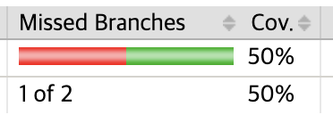

# 목차

<br>

- [목차](#목차)
- [테스트에 대한 비용 편익 분석](#테스트에-대한-비용-편익-분석)
- [단위 테스트 목표](#단위-테스트-목표)
- [테스트 품질을 측정하는 커버리지 지표](#테스트-품질을-측정하는-커버리지-지표)
  - [두 가지 테스트 커버리지의 문제](#두-가지-테스트-커버리지의-문제)
  - [커버리지 지표에 대한 문제](#커버리지-지표에-대한-문제)
  - [특정 커버리지 숫자를 목표로하지 말아라](#특정-커버리지-숫자를-목표로하지-말아라)
- [무엇이 성공적인 테스트를 만드는가? - 중요](#무엇이-성공적인-테스트를-만드는가---중요)

<br>

# 테스트에 대한 비용 편익 분석
테스트를 무작정 많이 작성한다고 좋은 것은 아닌 것 같다.

노력을 많이 들이고 단위 테스트를 매우 많이 작성하더라도 많은 버그와 유지비로 프로젝트 진행이 느려진다.

물론 단위 테스트는 잘 작성한다면 훌륭한 결과를 만들고 코드 품질을 높인다. 다만, 그다지 도움이 되지 않고 자주 고장나면서 유지보수 비용이 더 드는 단위 테스트가 작성될 가능성도 높다.

즉, **테스트에 대한 비용 편익 분석을 통해 특정 상황에서 적절한 테스트 기술을 적용시켜 테스트하는 것이 좋다.**

> 단위 테스트에 시간을 투자할 때는 항상 최대한 이득을 얻도록 노력해야하며, 테스트에 드는 노력을 가능한 한 줄이고 그에 따르는 이득을 최대화해야 한다.

<br>

# 단위 테스트 목표

<br>

💁‍♂️ **단위 테스트는 이제 필수.**

지난 20년간 단위 테스트를 적용시키는 것은 강요하다시피 되었고, 지금은 "단위 테스트를 작성해야 하는가?"에서 "좋은 단위 테스트를 작성하는 것은 어떤 의미인가?"로 바뀌었다.

이는 **단위테스트는 이미 필수가 되었으며, 대신 좋은 단위 테스트를 작성하는 방법에 대해 알아야한다는 것을 의미한다.**

**이는 도움이 될 것이라 생각한 단위 테스트가 상황에 따라 전혀 도움이 되지 않고 오히려 더 악화시킬 수 있기 때문이다.**

<br>

🤔 **단위 테스트의 목표 - 중요**

* **소프트웨어 프로젝트의 지속 가능한 성장을 가능하게 하는 것**
  * **핵심은 지속 가능한 성장이다.**
* **테스트 있는 프로젝트와 없는 프로젝트의 차이 -> 테스트가 없는 프로젝트의 경우 시작은 유리하지만, 이내 진척이 없을 정도로 느려진다**
  * 프로젝트 초반에 테스트가 없으면 개발 속도가 빠르다. 하지만 프로젝트가 점차 진척이 있을수록 소요되는 시간이 비약적으로 늘게된다.
  * 반면에 테스트가 있으면 초반엔 개발 속도가 느지리만, 프로젝트가 점차 진척되면 될 수록 소요되는 시간이 줄어든다.
* 지속 가능한 성장을 위해선 좋은 테스트가 많아야한다.

<br>

💁‍♂️ **테스트가 없으면 소프트웨어 엔트로피가 증가한다**

* **개발 속도가 빠르게 감소하는 현상을 소프트웨어 엔트로피라고한다. - 무질서도**
* **테스트가 없으면 코드에 변경이 발생할 때마다 무질서도가 증가한다.**
  * 버그를 수정하면 더 많은 버그가 양산하고, 한 부분을 수정하면 다른 부분들이 고장난다. (도미노 현상)
* 지속적인 리팩터링과 **테스트 코드 추가**를 통해 이를 방지할 수 있다.
  * 물론 좋은 테스트!

<br>

🤔 **그렇다면 좋은 테스트와 나쁜 테스트를 가르는 요인은?**

* 나쁜 테스트는 작성하는 것만 못하다.
  * 테스트가 잘못 작성된 프로젝트는 초반에는 테스트가 잘 작성된 프로젝트의 속성을 보여주지만, 결국 침체 단계에 빠진다.
* 테스트도 다 똑같은 테스트가 아니다.
  * 일부 테스트는 아주 중요하고 코드 품질에 많은 기여를 한다. 반면에, 전혀 도움이 안되고, 오히려 유지 보수가 어렵게하는 테스트가 존재한다.
* **아래 활동에 대한 비용이 높아서 순가치가 0에 가까우면 좋은 테스트가 아니다.**
  * 기반 코드를 리팩터링할 때 테스트도 리팩터링하라.
  * 각 코드 변경시 테스트를 실행하라.
  * 테스트가 잘못된 경고를 발생시킬 경우 처리하라.
  * 기반 코드가 어떻게 동작하는지 이해하려고 할 때는 테스트를 읽는 데 시간을 투자하라.

<br>

🤔 **단위 테스트와 코드 설계의 관계**

* 코드를 단위 테스트하기 어렵다면 코드 개선이 필요하다는 의미가 된다.
* 보통 강결합에서 저품질이 나타나며, 강결합은 제품 코드가 서로 충분히 분리되지 않아서 따로 테스트하기 어려움을 뜻한다.

<br>

# 테스트 품질을 측정하는 커버리지 지표
필자 주변엔 테스트 커버리지 숫자에 매몰돼 커버리지 지표가 높으면 높을 수록 좋다고 주장하는 분들이 계신다.

필자도 처음엔 숫자를 통해 품질을 나타낸다는 점에서 동의했지만 이 책을 보고 조금은 마음이 변하게 되었다.

<br>

## 두 가지 테스트 커버리지의 문제
테스트 커버리지는 크게 두 가지 방법이 존재한다.
1. 코드 커버리지
2. 분기 커버리지

<br>

🤔 **코드 커버리지란? 무엇이 문제인가?**

코드 커버리지란 테스트로 실행된 코드 라인 수와 제품 코드 베이스의 전체 라인 수의 비율을 나타낸다.

**코드 커버리지 = 실행 코드 라인의 수 / 전체 라인 수**

문제는 아래와 같이 코드 커버리지가 높다고 테스트의 품질을 측정할 수 없다.

> 메서드를 부분적으로 다루는 테스트

```java
public static boolean isStringLong(String input) {
    if (input.length() > 5) {
        return true;
    }
    return false;
}

@Test
void isStringLong() {
    boolean result = isStringLong("abc");
    assertThat(result).isFalse();
}
```
위 코드를 jacoco를 통해 커버리지를 계산해보면 아래와 같이 50%가 나온다.

<p align="center"> </p>

문제는 아래와 같이 리팩터링하고 다시 커버리지를 계산하면 100%가 될 수 있다.

> 메서드 리팩터링
```java
public static boolean isStringLong(String input) {
    return input.length() > 5;
}
```
로직상 리팩터링한 이유가 없는 부분이지만, 테스트 커버리지는 높아진 것이다.

이를 코드의 품질을 높였다고 할 수 있는가? 물론 아니다.

> jacoco의 경우는 동일하게 50%로 잡는다! 똑똑한데?

<br>

🤔 **분기 커버리지란? 무엇이 문제인가?**

분기 커버리지란 원시 코드 라인 수를 사용하는 대신 if문과 switch문과 같은 제어 구조에 중점을 두고 측정하는 방법이다.

**분기 커버리지 = 통과 분기 / 전체 분기 수**

위와 동일한 방식으로 동작시키면 50%가 나오게된다.

> 
```java
public static boolean isStringLong(String input) {
    if (input.length() > 5) {
        return true;
    }
    return false;
}
```
하지만 이 방법도 높을수록 좋은 코드라고 단정할 순 없다.

<br>

## 커버리지 지표에 대한 문제
어떠한 커버리지 지표도 코드 품질을 평가할 수 없는 이유는 다음과 같다.

1. 테스트 대상 시스템의 모든 가능한 결과를 검증한다고 보장할 수 없다.
2. 외부 라이브러리의 코드 경로를 고려할 수 있는 커버리지 지표는 없다.

<br>

💁‍♂️ **테스트 대상 시스템의 모든 가능한 결과를 검증한다고 보장할 수 없다.**

> 마지막 결과를 저장하는 isStringLong

```java
public static boolean isStringLongV2(String input) {
    boolean response = input.length() > 5;
    WAS_LAST_STRING_LONG = response; // 마지막 결과 기록
    return response;
}

@Test
void isStringLongV2() {
    boolean result = StringLongUtil.isStringLongV2("abc");
    assertThat(result).isFalse();
}
```
위와 같이 메서드안에서 결과를 따로 다른 변수에 기록하는 것까지 테스트하지 않아도 커버리지는 100%가 나오게된다.

또한, 검증이 없는 테스트는 항상 통과하며 커버리지를 높이게된다.

> 검증 없는 테스트는 언제나 통과한다.
```java
@Test
void isStringLongV2_2() {
    boolean result1 = StringLongUtil.isStringLongV2("abc"); // true
    boolean result2 = StringLongUtil.isStringLongV2("acdef"); // false
}
```

<br>

💁‍♂️ **외부 라이브러리의 코드 경로를 고려할 수 있는 커버리지 지표는 없다.**

```java
public static int parse(String integer) {
    return Integer.parseInt(integer);
}

@Test
void Integer_Parse() {
    String integer = "123";
    int result = StringLongUtil.parse(integer);
    assertThat(result).isEqualTo(123);
}
```
`Integer.parse`함수 내에는 많은 분기를 통해 값을 검증한다.

하지만 위와 같이 테스트를 작성하면 `parse`안 테스트 코드는 커버리지에 포함되지 않는다.

테스트 커버리지가 100프로 나온다고 100프로라고 볼 수 있겠는가?

<br>

## 특정 커버리지 숫자를 목표로하지 말아라
위와 같이 커버리지 숫자는 그저 참고 값일 뿐이다.

예를 들어, 병원에 있는 환자가 체온이 높으면 열이 난다는 것을 의미할 수 있으며, 이는 유용한 관찰이다.

그러나 병원은 환자의 적절한 체온을 목표로해서는 안 된다. 단순히 목표가 된다면, 환자 옆에 에어컨을 두면 되기 때문이다.

하지만 이는 아무런 효과가 없다.

커버리지 숫자는 좋은 부정 지표이지만 나쁜 긍정 지표이기도 하다.

<br>

# 무엇이 성공적인 테스트를 만드는가? - 중요

🤔 **결국 제대로 코드 품질을 측정하려면?**

* 테스트를 하나씩 따로 평가하는 것 뿐이다. 그리고 이는 개인 판단에 맡겨야한다..
* **성공적인 테스트는 다음과 같은 특성을 갖는다. - 중요**
  1. 개발 주기에 통합돼 있다.
     * 아무리 작은 변경에도 모든 테스트를 실행해준다.
  2. 코드베이스에서 가장 중요한 부분만을 대상으로 한다.
     * 핵심 코드인 도메인 코드있는 부분 테스트에 시간 투자를 많이 한다.
     * 물론 통합 테스트를 통해 도메인 모델을 포함해 인프라 코드까지 테스트할 수 있다. 좋지만 핵심은 도메인이어야한다.
  3. 최소한의 유지비로 최대의 가치를 끌어낸다.
     * 가치있는 테스트 식별하고 작성해야한다.


