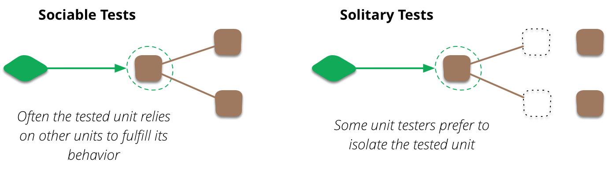

# 목차

<br>

<br>

# 1 '단위'의 정의

<br>

## 1-1 단위 테스트의 세 가지 속성

💁‍♂️ 단위 테스트의 세 가지 속성

* **작은 코드 조각(단위라고도 함)을 검증하고,**
  * 다양한 해석이 가능하다. '단위'의 기준은 무엇일까?
* **빠르게 수행하고.**
  * 모두 수긍하는 속성
* **격리된 방식으로 처리하는 자동화된 테스트다.**
  * 고전파와 런던파(Mockist)

<br>

## 1-2 단위의 기준 - 격리

<p align="center"><br>출처: https://martinfowler.com/bliki/UnitTest.html </p>

<br>

🤔 **런던파**(Mockist)

* **'단위'란 무조건 고립되서 단독적으로 실행되어야한다는 것을 의미**한다.
  * 예를 들어, 주문 함수의 계산 메서드를 테스트한다고 가정해보자.
  * 계산 메서드는 상품이나 고객 클래스의 일부 함수들을 사용하게 된다.
  * 이때 고객이나 상품 클래스가 가지는 문제로 테스트가 실패하기를 원하지 않아 Mock객체를 만들어 테스트하는 것을 런던파라고한다.
* 장점
  * 테스트가 실패하면 코드베이스의 어느 부분이 고장 났는지 확실히 알 수 있다. (필자는 개인적으로 동의하지 않는다)
  * 개체 그래프를 분할할 수 있다.
  * 프로젝트 전반적으로 한 번에 한 클래스만 테스트하라는 지침이 있다면 전체 단위 테스트 코드를 간단한 구조로 할 수 있다.
  * 외부 서비스와 통신할 때의 '비결정적' 위험때문에 Mock을 만들어 테스트하는 것이 맞다.
  * Mock을 만들어 테스트하는 것이 속도도 더 빠르다.
* 단점
  * 성공하는 테스트를 작성할 확률이 높다. (필자의 생각)

<br>

🤔 **고전파**

* **Mock객체를 사용하지 않고 실제 의존하고 있는 클래스를 사용하여 테스트하는 것을 의미**한다.
* 장점
  * 통합 테스트를 할 수 있다. (실제 운영상태와 비슷한 환경에서의 테스트를 진행할 수 있다.)
* 단점
  * 테스트 간에 실행 컨텍스트가 공유된다면 테스트가 꼬인다. (대표적인 예시 -> DB) -> 테스트 간의 간섭

<br>

## 1-3 예시로 보는 고전파와 런던파
이론만 보는 것보단 직접 코드를 통해 보는 것이 도움된다.

간단한 요구사항을 구현하여 고전파와 런던파의 차이점을 살펴보자.

요구사항은 다음과 같다.

* 온라인 상점을 운영하며, 고객이 제품을 구매할 수 있는 유스케이스.
  * 상점에 재고가 충분하면 구매는 성공으로 간주되고, 구매 수량만큼 상점의 제품 수량이 줄어든다.
  * 제품이 충분하지 않으면 구매는 성공하지 못하고 상점은 아무 일도 일어나지 않는다.

<br>

> Product.java
```java
public class Product {
    private final String name;

    public Product(String name) {
        this.name = name;
    }

    // .. getter, equals, hashCode
}
```
> Store.java
```java
public class Store {

    private final Map<Product, Integer> inventory;

    public Store(Map<Product, Integer> inventory) {
        this.inventory = inventory;
    }

    public boolean hasEnoughInventory(Product product, int quantity) {
        if (quantity < 0) {
            return false;
        }
        return inventory.getOrDefault(product, -1) > quantity;
    }

    public void addInventory(Product product, int quantity) {
        if (inventory.containsKey(product)) {
            inventory.computeIfPresent(product, (key, value) -> value + quantity);
        }
        inventory.put(product, quantity);
    }
}
```
> Customer.java
```java
public class Customer {

    public boolean purchase(Store store, Product product, int quantity) {
        if (!store.hasEnoughInventory(product, quantity)) {
            return false;
        }

        store.removeInventory(product, quantity);

        return true;
    }
}
```
위 코드의 의존성 방향은 아래와 같다.

* Customer
  * Customer -> Store
  * Customer -> Product
* Store
  * Store -> Product
* Product
  * 없음

<br>

💁‍♂️ **고전파 테스트**

우선 고전파의 테스트부터 작성해본다. SUT (System Under Test)는 Customer이다.

```java
public class CustomerSociableTest {

    @Test
    void 재고가_충분할_때_구매_성공() {
        // given
        Product shampoo = new Product("Shampoo");
        Store store = new Store(new HashMap<>());
        store.addInventory(shampoo, 10);
        Customer customer = new Customer();

        // when
        boolean actual = customer.purchase(store, shampoo, 5);

        // then
        assertThat(actual).isTrue();
    }

    @Test
    void 재고가_충분하지_않아서_구매_실패() {
        // given
        Product shampoo = new Product("Shampoo");
        Store store = new Store(new HashMap<>());
        store.addInventory(shampoo, 5);
        Customer customer = new Customer();

        // when
        boolean actual = customer.purchase(store, shampoo, 10);

        // then
        assertThat(actual).isFalse();
    }
}
```
* 의존성 해석
  * `Customer`는 실제 운영할 때 사용되는 `Store`객체를 사용한다. (`Store`, `Product`)
* 장점
  * `Customer`만 테스트하더라도 `Customer`에 영향을 미치는 `Store`도 같이 테스트된다.
* 단점
  * `Store`와 `Customer`가 서로 격리되어 있지 않기에, `Store` 내부의 버그가 있다면 `Customer` 테스트에 영향을 끼친다.
  * 컨텍스트를 공유하는 두 개이상의 테스트가 존재한다면, 테스트끼리 간섭할 수 있다.

<br>

💁‍♂️ **런던파 테스트**

이제 위 고전파의 테스트를 런던파 테스트로 바꿔본다.

```java
@ExtendWith(MockitoExtension.class)
public class CustomerSolitaryTest {

    @Test
    void 재고가_충분할_때_구매_성공() {
        // given
        Product product = new Product("Shampoo");
        Customer customer = new Customer();
        Store store = Mockito.mock(Store.class);

        // mock
        given(store.hasEnoughInventory(product, 5)).willReturn(true);

        // when
        boolean actual = customer.purchase(store, product, 5);

        // then
        assertThat(actual).isTrue();
    }

    @Test
    void 재고가_충분하지_않아서_구매_실패() {
        // given
        Product product = new Product("Shampoo");
        Customer customer = new Customer();
        Store store = Mockito.mock(Store.class);

        // mock
        given(store.hasEnoughInventory(product, 5)).willReturn(false);

        // when
        boolean actual = customer.purchase(store, product, 5);

        // then
        assertThat(actual).isFalse();
    }
}
```
* 의존성 해석
  * `Customer`는 목킹된 `Store` 객체를 사용한다. 
* 장점
  * `Customer`과 `Store`를 완벽히 격리시킬 수 있다. (테스트 간의 간섭이 없다)
* 단점
  * 무조건 성공하는 테스트만 작성하게 된다...

<br>

💁‍♂️ 두 테스트의 차이점
* 고전파
  * 상태를 검증했다.
* 런던파
  * 상호 작용 (행위)를 검증했다.

<br>

## 1-4 다양한 의존성
테스트할 때 다양한 의존성이 존재한다.
* 공유 의존성
  * 테스트 간에 공유되고 서로의 결과에 영향을 미칠 수 있는 수단을 제공하는 의존성.
    * ex. 정적 가변 필드 (static final)
    * ex. DB
    * ex. Spring Test ApplicationContext
  * 자원이 공유됨으로써 테스트간의 간섭이 발생하지만, 테스트 속도가 빠른 장점이 있다.
* 비공개 의존성
  * 공유하지 않는 의존성
* 프로세스 외부 의존성
  * 애플리케이션 실행 프로세스 외부에서 실행되는 의존성이며, 아직 메모리에 없는 데이터에 대한 프록시를 의미한다.
  * 프로세스 외부 의존성은 대부분 공유 의존성에 해당하지만 모두 그런것은 아니다.
    * ex. DB는 프로세스 외부이면서 공유 의존성이다. 단, 매 테스트마다 도커 컨테이너로 새로 띄운다면 공유하지 않는 상태가 된다.
* 휘발성 의존성
  * 다음 속성 중 하나를 나타내는 의존성을 의미한다.
    * 컴퓨터에 설치된 환경 외에 런타임 환경의 설정 및 구성이 요구된다. (ex. DB, 외부 API서버) 이는 기본적으로 컴퓨터에 설치되지 않는 사항을 의미한다.
    * 비결정적 동작을 포함한다. (ex. 난수 생성기, 현재 날짜, 시간등을 반환하는 클래스) 호출할 때마다 다른 값을 반환하기에 비결정적이라 부른다.
  * 공유 의존성과의 차이점은?
    * 테스트가 DB에 의존하면 공유 의존성이자 휘발성 의존성이다.
    * 파일 시스템은 휘발성이 아니지만, 파일 시스템을 통해 단위 테스트가 실행 컨텍스트를 서로 공유한다면 공유 의존성이다.
    * 마찬가지로 난수 생성기는 휘발성이지만, 각 테스트의 별도의 인스턴스를 제공할 수 있으므로 공유 의존성이 아니다.

<br>

> 테스트 대역과 목
> * 테스트 대역은 실행과 관련 없이 모든 종류의 가짜 의존성을 설명하는 포괄적인 용어.
> * 목은 그러한 의존성의 한 종류.

<br>

# 2 


