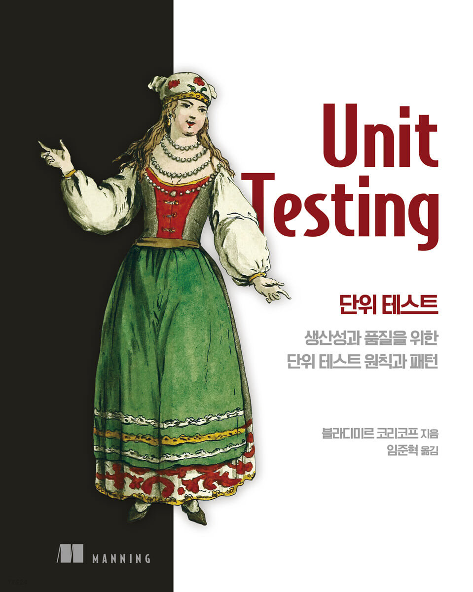

# 단위 테스트 - 생산성과 품질을 위한 단위 테스트 원칙과 패턴

 

위 책을 기반으로 작성된 자료입니다.

책에선 C#을 사용하지만, 본 자료는 자바를 사용해 정리하였습니다.

 

# 목차
* [단위 테스트의 목표는 무엇이며, 왜 하는가?](./01-%EB%8B%A8%EC%9C%84%ED%85%8C%EC%8A%A4%ED%8A%B8%EC%9D%98%EB%AA%A9%ED%91%9C.md)
* [단위 테스트란 무엇인가?](./02-%EB%8B%A8%EC%9C%84%ED%85%8C%EC%8A%A4%ED%8A%B8%EB%9E%80%EB%AC%B4%EC%97%87%EC%9D%B8%EA%B0%80.md)
* [단위 테스트 구조](./03-%EB%8B%A8%EC%9C%84%ED%85%8C%EC%8A%A4%ED%8A%B8%EA%B5%AC%EC%A1%B0.md)

